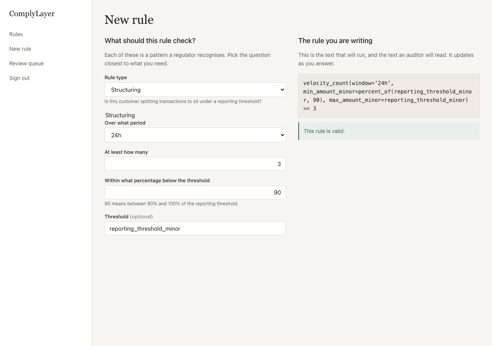
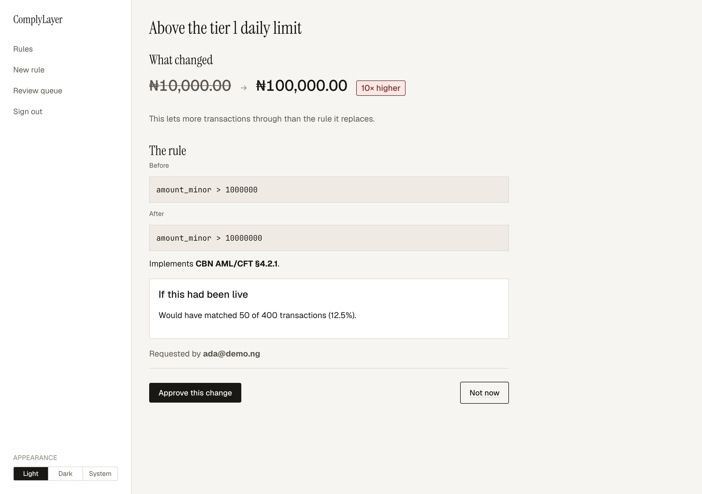
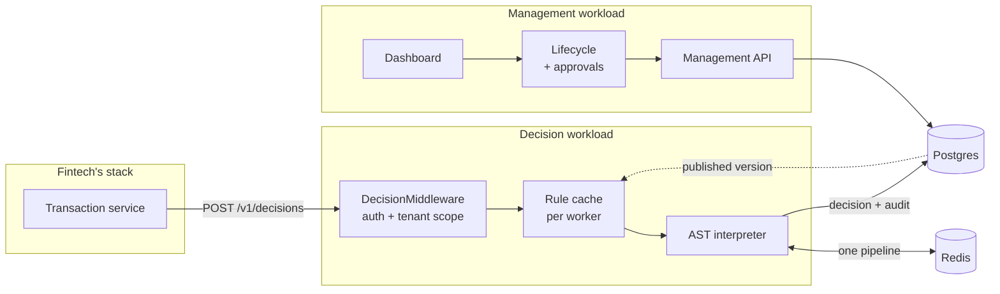
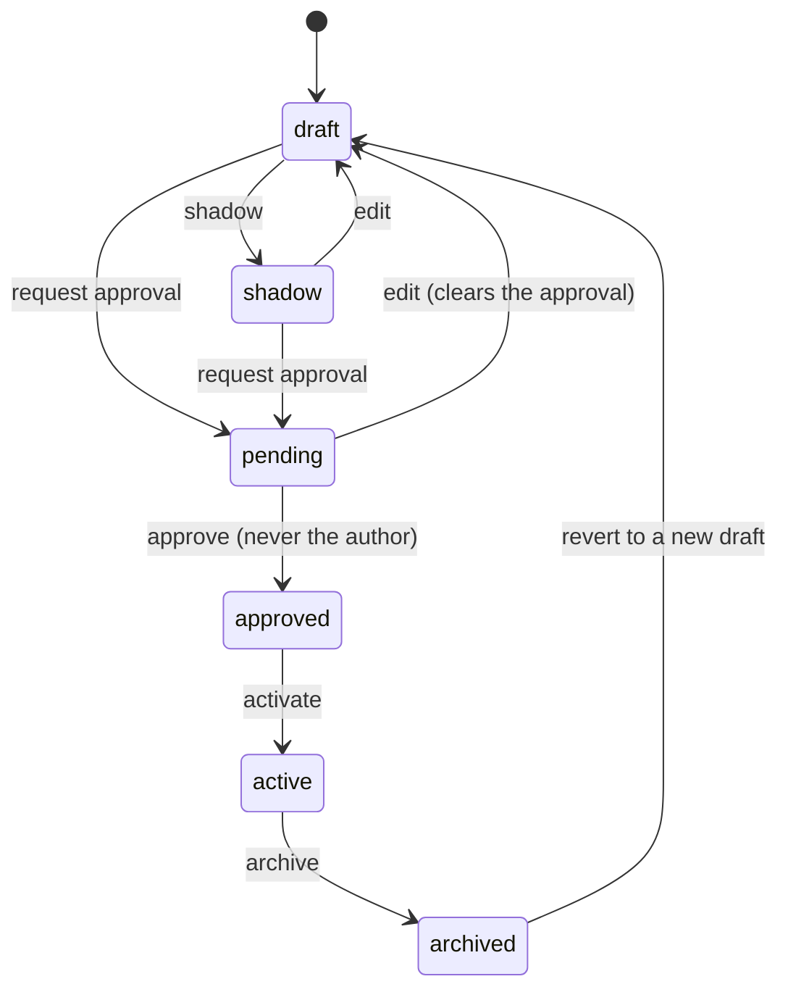

# ComplyLayer

Pluggable compliance rules and decision engine for fintechs.

ComplyLayer sits in front of a transaction and answers `allow`, `flag` or `block`
in under 100 milliseconds, against rules a compliance officer wrote, tested and
approved themselves — with no engineer, no pull request and no deploy.

<!-- phase: 8 -->

## See it work

```bash
make up && make demo
```

One command from nothing to a compliance decision. It creates a throwaway
database, seeds a tenant with three rules — written by one person and approved
by another, because nobody approves their own change — starts a worker, and
sends real transactions through `POST /v1/decisions`:

```
  TXN-DEMO-1  small transfer  ₦500
    → allow   (3 rules evaluated, 0 matched, 15 ms)

  TXN-DEMO-2  above the tier limit  ₦50000
    → block   (3 rules evaluated, 1 matched, 5 ms)
      rul_92f1346e  "Above the tier 1 daily limit"   CBN AML/CFT §4.2.1
      customer: "This transfer is above your daily limit. Upgrade your tier to continue."

  TXN-DEMO-3  the sixth transfer this hour  ₦200
    → flag    (3 rules evaluated, 1 matched, 5 ms)
      rul_1d80660f  "More than five transfers in an hour"   CBN AML/CFT §6.1
```

Then it prints the decision log and the audit chain, and tears everything down.
Nothing is left behind.

That is the whole product in one screen: a rule a compliance officer wrote,
enforced in milliseconds, citing the regulation it implements, in language a
customer can read.

## Who writes the rules

Not an engineer. The builder asks questions in the language of the regulation
and writes the expression as the officer answers — the same text that runs, and
the same text an auditor reads.



And an approval is not a text diff. A reviewer scanning red and green lines sees
one character move and approves it, so the change is shown in the unit a person
thinks in, with the direction, the magnitude, the regulation it claims, and what
it would have done to recorded history.



Nobody approves their own change, whatever their role. Both screens come from
`make dashboard`, which seeds this exact state on a throwaway database.

---

## Controls that were configured and did nothing

This is the part of the project worth reading.

Every row below passed code review, had tests, and did nothing. Not one was
found by adding another test — the suite was green through all of them. They
were found by running the thing: starting a server and calling it, dropping the
database connection to the role the docs recommend, scraping the metrics
endpoint more than once, opening the dashboard to take a photograph.

| What it claimed | What it did | Found by |
| --- | --- | --- |
| `POST /v1/decisions` serves decisions | Raised `AttributeError` on its first real request. 832 tests passed by attaching the handler themselves — the seam every test used was the seam nobody built | Starting the server and calling it |
| Velocity rules work | Returned 500. `_gather` handed back the constructor's provider, which production never sets, so the functions bound to `None` | `make demo`, first run |
| The dashboard has a second factor | A stolen password reached `/dashboard/enrol`, which issued a fresh TOTP secret on render and destroyed the owner's | Writing the exploit |
| API keys are 192-bit secrets | The verification cache was keyed on the 16-character prefix, which is public by design, and a hit skipped the secret entirely | Writing the exploit |
| Keys can be revoked | `revoke_from_cache` had no caller outside the tests, nothing re-read `revoked_at`, and there was no endpoint at all — revocation meant an `UPDATE` typed into psql | Grepping for callers |
| Row level security isolates tenants | `tenant_scope()` had no caller in production code at all. The setting was NULL on every request, so every policy matched nothing | Running the app as `complylayer_app` |
| …and covers every tenant table | `complylayer_dashboarduser`, which holds every user's TOTP secret, had no policy | A test comparing models against the migration |
| Customer references are pseudonymised | The HMAC key defaulted to the tenant id — a column on every row it protects | Reading the one line that used it |
| A forgotten `SECRET_KEY` is caught | Nothing checked. The published default signs the session that carries the second-factor flag | `manage.py check --deploy`, never run |
| Brute force is impractical | Nothing was rate limited anywhere. Six digits, unlimited guesses | Doing the arithmetic |
| `complylayer_ruleset_version` detects worker skew | Lived in each worker's own registry. Six scrapes: two returned it, four returned nothing | Scraping twice |
| The approval screen shows impact | A literal: the same 1,204 of 48,190 for every rule and every tenant | Photographing it |
| The container runs | The image had never built. `pyproject` points at a README that `.dockerignore` excluded | Building it in CI |
| semgrep is a security gate | `--config auto` resolves rules over the network at run time; the same tree gave 0 findings one day and 5 the next | A green local run disagreeing with CI |

All of them are self-inflicted — this is a single-author repository, so every
row is a control I wrote, reviewed and believed. That is the point rather than a
caveat: the tests were mine too, and they all passed.

**The pattern is always the same.** A control is configured, a test asserts the
configuration, and nothing ever executes the path production takes. Tests inject
what production builds; the superuser skips the policy the app role would hit;
the metric is read once when the bug only appears on the second read. A test
that supplies the thing under test proves the test works.

Each fix ships with the exploit as a test —
[`test_api_key_auth.py`](tests/test_api_key_auth.py),
[`test_rls_every_table.py`](tests/test_rls_every_table.py),
[`test_decision_wiring.py`](tests/test_decision_wiring.py) — because a fix
without the failure beside it is a fix nobody can tell got undone.

---

## 1. The problem

A fintech's compliance controls live inside the transaction service. Changing a
threshold — the daily limit for a tier-1 customer, the velocity that counts as
structuring — means a ticket, an engineer, a code review, a deploy, and a week.

Meanwhile the regulator changes the rule in a circular with thirty days' notice,
the fraud pattern changes on a Tuesday, and the person who is personally liable
for the control has no way to touch it.

> **The person who owns the regulatory risk cannot change the control, and the
> person who can change it does not own the risk.**

That gap costs money in both directions: controls that stay too loose for months
because nobody had capacity, and controls that stay too tight because loosening
them needs the same week-long cycle and nobody wants to be the one who did it.

ComplyLayer moves the control out of the transaction service and into a rule set
a compliance officer edits directly, with an approval workflow, a backtest
against real history, and an audit trail that is evidence rather than a log.

### What it is not

**ComplyLayer never moves money and never blocks a transaction itself.** It
returns a verdict; the fintech's own system enforces it. Every response carries
the rules that matched, the regulation each one cites, and a customer-facing
message the compliance team wrote.

That boundary is load-bearing. A total compromise of ComplyLayer — every key
stolen, every row rewritten — cannot move a naira. The worst an attacker
achieves is a wrong verdict, which is why the degradation behaviour in §6 is
specified per severity rather than left to chance.

**It is also not a fraud-scoring product.** There is no model, no score and
nothing probabilistic. A decision is a deterministic function of a pinned rule
set version and a recorded set of facts, and §6 explains what that buys: the same
inputs replayed six months later produce the same answer, which is what makes a
decision defensible to a regulator rather than merely explicable.

---

## 2. How it works



The path a decision takes:

1. **Authenticate** (`api/decision_middleware.py`). The API key resolves to
   exactly one tenant, and the request runs inside that tenant's row level
   security scope. Argon2id verification is cached for 60 seconds against a
   digest of the whole key; the key's row is read every request, so revoking one
   stops it on the next call.
2. **Load the rule set** (`engine/cache.py`). Each worker holds the compiled rule
   set in memory, keyed by version, swapped atomically. There is no database read
   on the decision path. A background watcher keeps it current by subscription
   *and* by poll — the poll is what the 30-second propagation guarantee actually
   rests on.
3. **Gather facts** (`velocity/redis_store.py`). One Redis round trip returns
   every rolling window and every customer aggregate the rule set needs, with this
   transaction already recorded inside the same `MULTI/EXEC`. That atomicity is
   the entire reason velocity rules are exact under concurrency (§6).
4. **Evaluate** (`dsl/interpreter.py`). Rules run in priority order against an
   AST allowlist interpreter — never `eval` — under a step budget and a node
   ceiling. The highest severity that matched decides the outcome.
5. **Record** (`api/handler.py`). The decision, the resolved facts and the pinned
   rule set version are written to a monthly partition, and the lifecycle event is
   appended to the tenant's hash-chained audit trail.

### The two workloads

One image, two settings modules, selected by `DJANGO_SETTINGS_MODULE`.

| | Decision | Management |
| --- | --- | --- |
| Serves | `POST /v1/decisions` | Rules, approvals, backtest, dashboard |
| Budget | 100 ms p99 | 500 ms p99 |
| Framework | Plain Django view (ADR-0002) | DRF |
| Middleware | Auth, tenant scope | Sessions, CSRF, auth, clickjacking |
| Loads the management URLconf | **No** | Yes |

That last row is the point. A decision worker does not answer `403` on
`POST /v1/rules/{id}/activate` — **the route does not exist there**. A heavy
backtest cannot be scheduled onto a pod holding the latency contract, because
that pod has no code path that would accept it.

### Rule lifecycle



Two edges carry the product's whole argument:

- **`pending --> draft` on edit.** Editing a rule after approval clears the
  approval. Without that edge the workflow is theatre: approve a harmless
  version, then change the threshold.
- **`approved` is unreachable by the author**, whatever their role, including
  risk manager. §10.2's table gives the risk manager an unqualified tick for
  Approve; B4's acceptance criterion says the author cannot self-approve. The
  acceptance criterion wins, and `tenancy/roles.py` records why.

---

## 3. What each package does

### `complylayer/dsl` — the sandbox, which is the whole security argument

A compliance officer types an expression and it runs on the server. That is the
product, and it is also the largest attack surface here, so the sandbox was built
first, in phase 1, before anything that would use it.

**Never `eval`, never `exec`.** `scripts/no_eval_guard.py` fails the build on
either, and it runs as the *first* job in CI, alone, so a red build shows it
before anything else. ADR-0001 records why an allowlist beats a sandbox: a
denylist is a bet that you thought of everything.

Parse → validate → interpret, each stage narrowing:

| Stage | What it does |
| --- | --- |
| `parser.py` | A string-aware source scan, then `ast.parse`. ASCII-only source. |
| `validator.py` | `ALLOWED_NODES` allowlist, arity and keyword checks, constant types |
| `interpreter.py` | Walks the tree under a step budget. No attribute access at all. |

Every bound lives in `limits.py`, on one screen, because those numbers *are* the
security argument:

| Limit | Value | Why |
| --- | --- | --- |
| `MAX_SOURCE_CHARS` | 2000 | Several times the longest real rule; the tokenizer is never handed anything interesting |
| `MAX_NESTING_DEPTH` | 20 | Real rules nest two or three deep. The guard is for the ten-thousand-deep case that reaches CPython's C stack. |
| `MAX_UNARY_RUN` | 5 | `not not not …` recurses the same way brackets do |
| `MAX_NODES` | 200 | Applied after parsing |
| `MAX_STEPS` | 1000 | Applied at run time, so a rule cannot spin |

**Division is not in the grammar** (D6) — not restricted, absent. A rule cannot
produce a float, because 100% reproducibility and floating point do not sit
together in a system that has to explain a decision made six months ago.
`percent_of(1000, 90)` is `900`; integer in, integer out, everywhere.

The callable surface, which stays small:

| Function | Summary |
| --- | --- |
| `velocity_count(window=, min_amount_minor=, max_amount_minor=, transaction_type=)` | Transactions in a rolling window |
| `velocity_sum(…)` | Their total value, in minor units |
| `days_since(fact)` | Whole days between a timestamp fact and now |
| `in_list(value, list_name)` | Membership of a tenant-managed named list |
| `hour_of_day()` | 0–23, in the tenant's timezone |
| `abs`, `min`, `max` | As they look |
| `percent_of(amount, percent)` | A whole percentage, floored |

**The escape corpus is a blocking gate.** `tests/test_dsl_escapes.py` holds
hostile expressions — dunder walks, homoglyphs, deep nesting, brackets inside
string literals — and any change to `ALLOWED_NODES` or `ALLOWED_FUNCTIONS` needs
a matching entry. Writing it before the parser found three real bugs:

- `_guard_nesting` was **fully bypassable** by putting `)` inside a string
  literal. The depth scan counted brackets in source text without knowing what a
  string was. The scan is string-aware now.
- The homoglyph check sat on `visit_Name`, which never fires: `ast.parse`
  NFKC-normalises identifiers, so by the time the visitor runs the homoglyph is
  already plain ASCII. It moved to the source scan.
- `"10".rstrip("0")` returns `"1"`. On the one screen whose job is showing that a
  limit moved tenfold, that understated it by an order of magnitude. It has a
  named test, because the next person to tidy that formatting will reach for
  `rstrip` too.

Errors are a three-part catalogue — problem, fix, reason — and the dashboard's
live validator returns the *same* strings the API does. There is one catalogue,
and the builder does not get a friendlier version of it.

### `complylayer/engine` — evaluation, the versioned cache, and metrics

`evaluation.py` runs a compiled rule set in priority order and resolves the
outcome by highest severity. `Severity` is `block | flag | allow_with_note`;
`Outcome` is `allow | flag | block`; `State` is `draft | shadow | active |
archived`. A shadow rule is evaluated and recorded and **can never appear in a
returned outcome**, which is asserted directly rather than inferred.

`cache.py` is why a decision costs no database round trip. Three things in it are
less obvious than they look:

- **Per worker, not per pod** (D12). Gunicorn forks; each child has its own
  memory, cache and subscription. This is why the version gauge is labelled by
  worker — four workers disagreeing inside one pod is exactly the silent failure
  the metric exists to catch, and a per-pod label would average it away.
- **The snapshot is re-validated on load** (D5). A frozen rule set is data in a
  database, and a database is something an attacker who got that far can edit.
  Re-running the allowlist costs milliseconds once per version.
- **Pub/sub is not a guarantee.** A dropped subscription that never reconnects is
  the usual cause of version skew, and nothing errors when it happens. So there is
  a poll as well, and **the poll is what the correctness argument rests on**; the
  subscription only makes propagation fast. The test that matters severs the
  subscription entirely and requires the change to land anyway.

`metrics.py` renders Prometheus text with no client library. One thing in it was
wrong and is worth stating: `complylayer_ruleset_version` lived in each worker's
own registry. A scrape reaches exactly one worker, so the gauge built to detect
*disagreement between workers* could not see across them — six scrapes under two
workers returned the value twice and **nothing four times**. Gauges whose
disagreement is the signal now publish to Redis keyed by worker, with a TTL so a
worker killed mid-deploy stops reporting rather than becoming permanent false
skew. Counters and histograms stay in process, where per-worker sampling is a
statistical detail rather than a correctness one.

### `complylayer/velocity` — one round trip, exact under concurrency

Rolling windows are Redis sorted sets trimmed by timestamp; customer aggregates
are a hash. `record_and_gather` writes this transaction and reads the resulting
window **inside a single `MULTI/EXEC`** — see §6, because the design it replaced
was in the architecture plan and failed on its first test run.

Windows count **attempts, including blocked ones**. Eleven transfers just under
the reporting threshold with six declined is still structuring, and a window that
counted only successes would be blind to the pattern it exists to catch.

The aggregate facts a rule can name, all integers:
`lifetime_transaction_count`, `lifetime_volume_minor`, `average_transaction_minor`,
`prior_flag_count`, `days_since_last_activity`, `customer_known_days`.

Keys are scoped per tenant and per customer, so there is no key a rule could name
that reaches another tenant's counters.

### `complylayer/api` — the decision path

`decision.py` is a plain Django view, not DRF. The budget allows 3 ms for auth
and validation and 2 ms for serialisation, and a DRF request cycle routinely
costs more before any compliance logic runs. **Measured rather than assumed**:
DRF costs **+0.158 ms at p99** against a 100 ms contract. ADR-0002 records that
this is smaller than expected, and that the split survives on the *second*
argument — hand-written validation can **reject** unknown fields, which §8.4
requires, because a payload carrying a field ComplyLayer does not know about may
be carrying data it must never store.

Reported latency is **quantised to 5 ms** (D8). The exact figure is a side
channel for inferring how many rules matched, and rounding costs nothing. The
specification asked for the response to be *padded* to a floor; that was
rejected, because a floor high enough to hide anything breaches the p50 target.

`decision_middleware.py` exists because **the endpoint did not work**. All 832
tests attached `request.decision_handler` themselves, so every one passed against
an endpoint that raised `AttributeError` on its first real request. The seam
every test used was the seam nobody had built. `tests/test_decision_wiring.py`
goes through the real middleware stack and attaches nothing.

`auth.py` resolves a key to one tenant. Two properties, each wrong once, now held
down by the exploits that used to work:

- **The cache is keyed on the whole key.** It was keyed on the 16-character
  prefix — stored in the clear so a dashboard can show which key is which — and a
  cache hit returned credentials *without comparing the secret to anything*. For
  60 seconds at a time the effective credential was a public string.
- **Only the Argon2id verification is cached, never the key's existence.** The row
  is read every request, so revocation takes effect on the next call in every
  worker. Measured at **0.19 ms p50** against a 3 ms budget, while the cache still
  saves 26 ms — the query was never the expensive part.

**Keys are issued and revoked through the product** (`/v1/keys`), not through a
database client. Two properties make that endpoint safe to expose:

- **A key may only be issued with permissions its issuer already holds.** The
  check is a subset of the permission matrix, not a seniority comparison — roles
  are not ranked, and a separate who-may-issue-what table would drift from the
  matrix beside it. Without it, an integration credential is one request away
  from being able to activate compliance rules.
- **There is no update and no delete.** A key's role is what it was issued as,
  because a key that can be re-pointed makes its own past decisions
  unexplainable; and revocation sets `revoked_at` rather than removing the row,
  because decisions reference the key that made them.

### `complylayer/tenancy` — three layers, and the three ways they were inert

§8.1 asks for three independent isolation layers: a key resolving to one tenant,
a query layer scoping every read, and row level security returning nothing if
either is bypassed. Cross-tenant reads return **404, never 403** — a 403 confirms
the object exists, and rule ids are guessable enough for that to matter.

Layer three took three attempts, and each failure is the same failure in
different clothes.

**First: the policies were skipped entirely.** Postgres exempts `SUPERUSER` and
`BYPASSRLS` unconditionally, and `FORCE ROW LEVEL SECURITY` does not change that.
The compose default connects as a superuser, so every policy was configured,
visible in `\d`, and never consulted. Migration 0006 creates `complylayer_app`;
the doctor checks the connecting role, because a control that depends on somebody
reading a runbook is a control that is off.

**Second: under that role, authentication became impossible.**
`complylayer_apikey` was scoped by the tenant policy — but resolving a key is what
*determines* the tenant, so the setting was NULL and the lookup returned zero
rows. Every request answered 401. A deployment could have row level security or
authentication, never both. Migration 0008 gives resolution its own narrow door: a
`FOR SELECT` policy active only while a flag is set, and a function that sets it
for one call, returning one row by unique prefix. Deliberately not
`SECURITY DEFINER` — `FORCE` binds the table owner too, so definer rights would
not have helped.

**Third: nothing ever set the tenant.** `tenant_scope()`, the function whose
entire purpose is setting the variable every policy reads, **had no caller in
production code**. Only tests called it. The setting was NULL on every real
request, so the application authenticated and then behaved as though the database
were empty. The scope is now set in four places:

| Where | Covers |
| --- | --- |
| `DecisionMiddleware` | the decision request |
| `ApiKeyMiddleware` | every management request |
| `signed_in` | every authenticated dashboard view |
| `_load_published` | the rule-set read — `VersionWatcher` polls it from a thread with no request, and a poller that silently returned nothing would stop picking up new rules |

`complylayer_dashboarduser` had no policy at all. It carries a tenant and every
user's `totp_secret`, and was added in phase 6 after migration 0005's list was
written. Migration 0009 fixes it with the same resolver shape, because sign-in has
the identical bootstrap problem.

The durable part of that fix is neither migration. It is
`tests/test_rls_every_table.py::TestNothingScopedEscapedTheList`, which compares
the models carrying a tenant against the migration's list and fails until somebody
decides about the difference — because nobody removes a table from that list, and
the mistake that happens is adding a model and not thinking about it.

`scope.py` uses `SET LOCAL` inside an explicit transaction, never `SET`. A
session-scoped setting on a pooled connection outlives the request that made it
and is inherited by whoever borrows that connection next, which is the exact
cross-tenant read RLS exists to stop. pgbouncer runs in transaction mode for the
same reason. The scope is cleared explicitly on the way out, because `SET LOCAL`
is scoped to the *outermost* transaction and a nested `atomic()` opens a savepoint
whose release does not restore the previous value.

### `complylayer/audit` — evidence, not a log

§8.3 claims immutability is *enforced, not promised*. Four mechanisms, and the
order matters because each covers a case the one before does not:

1. **Grants.** The application role has `INSERT` and `SELECT` on the audit table
   and nothing else. An ORM bug cannot update a record because the connection has
   no permission to.
2. **A trigger.** `BEFORE UPDATE OR DELETE` raises regardless of who is asking, so
   a superuser at a psql prompt at 2am fails loudly. Grants protect against
   accident; the trigger protects against authority. A separate statement-level
   `TRUNCATE` guard exists because row triggers do not fire on `TRUNCATE` and it
   would otherwise walk straight past the other two.
3. **A hash chain**, per tenant. Each record's hash covers its content and the
   previous record's hash, so tampering anywhere invalidates everything after it.
   This is what catches an edit made *outside* the database — a restored backup,
   an altered replica.
4. **Corrections are appended, never applied.** A wrong record is followed by a
   compensating one carrying `corrects`. A trail that can be tidied is not a trail.

`recorded_at` is deliberately excluded from the hashed payload: it is when the row
was written, which a replica or a restore can legitimately differ on, and
including it would make the chain fail for reasons that are not tampering.

The chain is per tenant rather than global — one global chain would serialise a
busy tenant's writes behind everyone else's, and would leak the fact of one
tenant's activity into another's verification.

**The limitation that used to be open, and how it is closed.** The chain is
unkeyed SHA-256, so an attacker with write access can edit a record and recompute
every hash after it. The result is a valid chain of the wrong history, and
`verify_chain` is satisfied by it — recomputing is arithmetic, not forgery.

A fifth mechanism closes that: **signed checkpoints**. `complylayer_checkpoint`
signs the chain head with an Ed25519 key that is deliberately not in the database
it anchors. A rewrite still produces a consistent chain; it cannot produce a
signature over that chain without the private key.

The signed payload carries the chain *length* as well as the head hash, because
otherwise an attacker could delete everything after an older checkpoint and
present its signature as current.

Two honest limits remain, stated rather than papered over. **The interval between
checkpoint runs is the window in which a rewrite is undetectable** — a tamper at
10:05 against a chain last signed at 10:00 is invisible until the next run.
And with no key configured, verification reports `unanchored` rather than
passing: a check that cannot fail is a check that means nothing, and this answer
goes to a customer's auditor.

### `complylayer/rules` — the lifecycle and separation of duties

`lifecycle.py` is the state machine above, with the permission check and the audit
append in the same transaction as the state change. Approving, activating and
archiving each publish a new immutable `RuleSetVersion` snapshot — rules are never
read live on the decision path, they are compiled from a frozen snapshot, which is
what makes replay meaningful (§6).

`tenancy/roles.py` holds §10.2's permission table. The row that matters most is
the engineer's: **an engineer cannot create or activate a compliance rule.** That
is not an oversight in the matrix, it is the entire point of the product.

### `complylayer/dashboard` — where a compliance officer actually works

Server-rendered, per ADR-0004, and the main argument is that the views ask the
*same* permission functions the API asks. One implementation of who-may-do-what
means a button that should not exist is absent for the same reason the endpoint
returns 403.

**The rule builder** offers six shapes, each asking a question rather than naming
a construct — *"Is this customer splitting transactions to sit under a reporting
threshold?"* — with the regulation prefilled and the expression writing itself as
the officer answers. Every rule in §4.4 is reachable through the builder without
touching the expression editor, and that is asserted on every commit. If an
officer has to drop into the editor for the rules that matter, an engineer is back
in the loop and the pitch is false.

**The approval diff is not a text diff.** A reviewer scanning red and green lines
sees a one-character change and approves it. The diff renders the change in
currency units at display size — `₦50,000.00 → ₦500,000.00`, `10× higher` — with
the direction called out, the regulation the rule claims, and what the new version
would have done to last month's transactions. Approve sits alone and unlocks only
once the impact figure has been on screen.

**Colour is reserved for severity.** No brand colour in the chrome, no blue
primary buttons, no coloured links. If a pixel is saturated it means `block`,
`flag`, `allow` or `degraded`. `DESIGN.md` is the authority.

**Two-step authentication**, password then TOTP, with the session marked at each
step. Every view checks the second-factor flag rather than
`request.user.is_authenticated`, because a user who has given a password and not a
code is authenticated as far as Django is concerned and has proved half of what
this product needs. Two things went wrong here; both are in §6.

### `complylayer/backtest` — and being honest about what it does not know

Replay a stored decision against its own rule set version, backtest a candidate
rule against recorded history, and report rule analytics.

The design decision that matters is what happens when history cannot answer. **An
approximate number on the screen where somebody is deciding whether to loosen a
control is worse than an honest blank.**

| Confidence | When | What it says |
| --- | --- | --- |
| `EXACT` | Every fact the rule needs was recorded | "Matched 50 of 100" |
| `PARTIAL` | Some decisions lack a needed fact | "…and 40 more could not be checked" |
| `UNAVAILABLE` | The fact was never recorded | Names the fact, and points at shadow mode |

The caveat travels *with* the number rather than sitting in a footnote, because
the sentence is what gets rendered. `matched 0` and `errored 4,000` are also
distinguishable, which they would not be if an unevaluable decision counted as a
non-match.

**Rule analytics name the rule drowning the queue**: false-positive rate derived
from recorded review outcomes, worst first — *"Fired 400 times and 95% were
cleared on review. This rule is spending reviewer time rather than catching
anything."* A rule nobody has reviewed reports an unknown rate rather than a
flattering zero.

Backtests run on the replica (`db_router.py`). A 30-day replay is the heaviest
read in the product, and running it on the primary is how a compliance officer
testing a rule causes a latency incident for the customer's transactions. The
router is explicit rather than clever: it does not guess which reads are
analytical, it only makes sure writes never reach the replica.

### `complylayer/checks` and `complylayer_doctor` — the preflight

The failure modes that matter most here are silent. A deployment with Redis in
another availability zone serves correct decisions and misses its SLA; a host
whose clock has drifted evaluates velocity windows against the wrong instant and
nothing errors. Every check carries its own remediation, because a preflight that
reports a problem without saying what to do about it has only moved the confusion.

| Check | Catches |
| --- | --- |
| Python version | Anything that is not 3.12 |
| Database | Unreachable, or Postgres below 16 |
| Redis round trip | Warns above 2 ms, fails above 10 ms — fact gathering has 15 ms |
| Clock skew | A drifting clock trims the wrong window and never raises |
| Audit trail | The append-only triggers missing, after a restore or a schema tool |
| Row level security | Connecting as a superuser or `BYPASSRLS`, where every policy is skipped |
| Deployment secrets | `SECRET_KEY` or `CUSTOMER_SALT` still on the value published in this repository |
| Transport security | Session cookie without `Secure`, no HSTS — skipped for the workload that issues no cookie |

`--strict` promotes every warning to a failure, which is what a deploy pipeline
should run: a warning acceptable on a laptop is usually not acceptable in
production.

The Redis check throws its first ping away. That one carries TCP connection setup,
which on a laptop running Docker measured **6.54 ms** and has nothing to do with
how far away Redis is — reporting it would send somebody hunting a network problem
they do not have. The median of five warm samples is 0.24 ms.

### `complylayer/partitions` — retention that is not a cron job

`Decision` is partitioned monthly from the first migration, not retrofitted. A
composite primary key of `(id, decided_at)` is what makes declarative partitioning
possible at all, and adding it later means rewriting the table.

`rows_in_default_partition()` is the alarm: anything landing there means partition
maintenance has stopped, and the failure is otherwise completely silent until the
table is unqueryable.

### `sdk/node` — and the argument that shaped it

A TypeScript client with no dependencies. The one decision worth calling out:
**`fallback` is a required argument with no default.** What a client does when
ComplyLayer is unreachable is a compliance decision, not a library convenience,
and a silent default is one a fintech discovers during an outage.

---

## 4. Try it

### See it work first

```bash
make up
```

Postgres and Redis in Docker. Then:

```bash
make install
```

Creates the venv with Python 3.12 and installs everything. Then:

```bash
uv run python manage.py migrate
```

Then check the deployment before believing any of it:

```bash
uv run python manage.py complylayer_doctor
```

On a fresh laptop that reports three warnings and no failures: the connecting role
is a superuser so row level security is skipped, the two secrets are still the
development values, and the session cookie flags are off because `DEBUG` is on.
All three are correct for a laptop and all three are fatal under `--strict`.

### The suite

```bash
make test              # everything that needs no Postgres or Redis
make test-integration  # the full suite, including the isolation and chaos gates
```

### Everything CI runs, in CI's order

```bash
make ci
```

`guard → readme-check → lint → cov → security`. The eval/exec guard is
deliberately first and deliberately alone: if the sandbox is broken then nothing
else in the pipeline matters, and a reviewer glancing at a red build should see
that immediately rather than scrolling past a lint failure.

### Set it up properly

Requires Python 3.12 exactly, Postgres 16+ and Redis 7+.

```bash
cp .env.example .env

# Both are refused at startup when DEBUG is off. The values in .env.example are
# published in this repository, so they are development-only by definition.
export COMPLYLAYER_SECRET_KEY="$(python -c 'import secrets; print(secrets.token_urlsafe(64))')"
export COMPLYLAYER_CUSTOMER_SALT="$(python -c 'import secrets; print(secrets.token_urlsafe(32))')"
```

`COMPLYLAYER_CUSTOMER_SALT` **cannot be rotated freely.** It is the HMAC key
pseudonymising customer references, so changing it re-pseudonymises every future
decision and the history stops joining to the new value. Set it once, keep it in a
secret manager rather than beside the database, and back it up with the database.

Then run the two workloads. They share one image and differ only by settings
module:

```bash
# Decision workload — the latency contract lives here
DJANGO_SETTINGS_MODULE=server.settings \
  uv run python -m gunicorn server.asgi:application \
    --worker-class uvicorn.workers.UvicornWorker --bind 0.0.0.0:8000 --workers 4

# Management workload — API, approvals, dashboard, backtest
DJANGO_SETTINGS_MODULE=server.settings_management \
  uv run python -m gunicorn server.asgi:application \
    --worker-class uvicorn.workers.UvicornWorker --bind 0.0.0.0:8001 --workers 2
```

Migrations run as the database owner; the application should connect as
`complylayer_app`, which migration 0006 creates and which is the only
configuration where row level security does anything. The doctor reports the
connecting role, and `--strict` fails on a superuser.

---

## 5. API

### Decision workload

| Method | Path | Purpose |
| --- | --- | --- |
| POST | `/v1/decisions` | The decision. Requires `Idempotency-Key`. Returns `allow`, `flag` or `block`. |
| GET | `/healthz` | Alive. Touches no dependency — a liveness probe that checks Redis turns one outage into two. |
| GET | `/readyz` | Can serve a decision, which means the rule cache is warm. |
| GET | `/metrics` | Prometheus text. Requires the scrape token when one is configured. |

### Management workload

| Method | Path | Purpose |
| --- | --- | --- |
| GET/POST | `/v1/rules` | List and create drafts |
| GET/PATCH/DELETE | `/v1/rules/{id}` | One rule. `state`, `version`, `approved_by` are read-only. |
| POST | `/v1/rules/validate` | Validate an expression without saving it |
| POST | `/v1/rules/{id}/request-approval` | Move a draft to pending |
| POST | `/v1/rules/{id}/approve` | Approve. Refused for the author, whatever their role. |
| POST | `/v1/rules/{id}/shadow` | Evaluate and record without affecting any outcome |
| POST | `/v1/rules/{id}/activate` | Publish a new rule set version |
| POST | `/v1/rules/{id}/archive` | Retire it |
| GET | `/v1/rulesets` | Published versions |
| GET | `/v1/rulesets/{version}` | One frozen snapshot, as decisions were evaluated against it |
| GET | `/v1/decisions` | The decision log, filterable |
| GET | `/v1/decisions/{id}` | One decision, with its resolved facts |
| POST | `/v1/decisions/{id}/review` | Record a reviewer's outcome — what rule analytics rests on |
| GET/POST | `/v1/lists` | Named lists a rule refers to by name |
| GET/PATCH/DELETE | `/v1/lists/{id}` | One list |
| GET/POST | `/v1/keys` | List and issue API keys. The secret is returned once. |
| GET | `/v1/keys/{id}` | One key, never its secret |
| POST | `/v1/keys/{id}/revoke` | Stop a key on its next request |

The serialisers make `state`, `version`, `created_by`, `approved_by`,
`approved_at` and `activated_at` read-only. A `PATCH` that could set
`state: active` would route around the approval workflow entirely, and an API
whose serialiser can undo its own state machine has no state machine.

The full schema is [`docs/openapi.yaml`](docs/openapi.yaml), and a test asserts
every route in the URLconf appears in it.

### Dashboard

`/dashboard/sign-in`, `/verify`, `/enrol`, `/sign-out`, then the rules list, the
builder at `/new`, the approval diff at `/rules/{id}`, and the review queue at
`/queue`. Live validation posts to `/preview` and `/validate`, which return the
same three-part errors the API does.

### Writing a rule

```text
amount_minor > tier_daily_limit_minor

velocity_count(window='1h', min_amount_minor=50000000) > 5

velocity_count(window='24h',
               min_amount_minor=percent_of(reporting_threshold_minor, 90),
               max_amount_minor=reporting_threshold_minor) >= 3

days_since(last_transaction_at) > 90 and amount_minor > 20000000

in_list(destination_country, high_risk_countries) and kyc_tier < 3
    and (hour_of_day() < 6 or hour_of_day() > 22)

days_since(account_created_at) < 7 and amount_minor > 10000000
```

Those are the six worked examples in §4.4, and
[a test asserts every one is reachable through the builder](tests/test_dashboard.py)
without typing an expression. If that test fails, the product's premise fails
with it.

### Integrating

```js
import { ComplyLayer, ComplianceBlockedError } from "@complylayer/node";

const client = new ComplyLayer({
  apiKey: process.env.COMPLYLAYER_API_KEY,
  fallback: "block",   // required, no default — 'allow' or 'block'
});

try {
  const decision = await client.check({
    transactionRef: "TXN-1",
    customerRef: "usr_1",
    amountMinor: 5_000_000,
    currency: "NGN",
    transactionType: "transfer",
  });
  // Reached on allow *and* on flag: a flagged transaction proceeds and is
  // reviewed. Check `decision.degraded` if you want to count fallbacks.
} catch (error) {
  if (error instanceof ComplianceBlockedError) {
    // error.message is the message the compliance team wrote for the customer.
  }
}
```

A block **throws** rather than returning, because the one thing a caller must not
do is treat it like any other response and carry on. A flag returns normally —
the transaction proceeds and a human reviews it.

`fallback` has no default on purpose. What your system does when ComplyLayer is
unreachable is a compliance decision, and a library that picked one for you is a
library whose choice you discover during an incident. Fallback decisions are
marked `degraded: true` so a caller can count them: a sustained degraded rate is
an incident, and the server cannot see the requests that never reached it.

The `Idempotency-Key` is the transaction reference, so retries are safe by
construction. A repeated key returns the original response **verbatim**,
including its original timestamp, decision id and recorded latency. A retry
reporting today's time would be a different decision wearing the same id, and the
audit trail would show two events for one transaction.

---

## 6. Correctness notes

These are the parts that were harder than they looked, and most were found by
running the system rather than by adding another passing test.

### Velocity under concurrency — the design that failed on first contact

D2 originally specified a short per-customer lock, taken only when a
`block`-severity velocity count landed within one of its threshold: away from the
boundary the answer is the same either way, so the ~5 ms was not worth paying.

**The concurrency test disproved it on the first run: 11 transactions passed a
threshold of 5.**

The flaw is that "near the boundary" is measured against what *this* decision
read, and with concurrent writers a read is arbitrarily stale. Sixteen threads can
each observe a count of zero and each write. A lock that engages at the boundary
cannot close a race that begins long before the boundary is in sight.

The replacement is simpler, faster and exact: the read and the write became one
atomic operation.

| | Lock, as designed | Atomic record-and-read |
| --- | --- | --- |
| Round trips | 2 | 1 |
| Extra latency at a boundary | ~5 ms plus a second evaluation | none |
| Exact for `block` rules | no, as measured | yes |
| Exact for `flag` rules | no, accepted as a trade | yes, for free |

§4.5's trade — imprecision for `flag` rules as the price of not locking — no
longer has to be made, so a reviewer's queue is not padded with transactions that
only appear to have crossed a threshold. The lock, the boundary detection in the
interpreter and the `needs_boundary_lock` signal through the engine were all built
before the test ran and all deleted after. Cheaper than shipping it.

### What happens when Redis is gone

§10.3 makes this a product decision rather than an accident, and a product
decision nobody tested is a paragraph. The chaos suite kills Redis and executes
the table line by line.

| Rule severity | Behaviour | Why |
| --- | --- | --- |
| `block` | **Fails closed** | A blocked transaction is one regulation says must not happen. "Our vendor was down" has never been a defence. |
| `flag` | **Fails open** | Flagging exists for human review. Halting every transaction because the review system is unavailable is disproportionate. |
| A tenant override | Changes the outcome, never the recording | |
| A rule needing no velocity | Decides normally | An amount limit does not need Redis. This is the difference between a degraded service and an outage. |
| A shadow rule that errors | Cannot change the outcome, even fail-closed | A shadow rule that blocked during an outage would be the worst possible version of "it never affects anyone" |

**Every degraded decision is recorded with its reason.** Otherwise "just take
ComplyLayer down" becomes a way to move money past the controls, and nothing
anywhere would report it.

Writing that suite found a real bug: a Redis outage during *fact gathering*
propagated out and returned a 500 rather than a degraded decision — the exact
failure the fail-open/fail-closed design exists to replace.

### Reproducibility, stated precisely enough to test

"The same decision, replayed, produces the same answer" only means something if
every input is pinned. Three things make it true:

- Rules are compiled from an **immutable `RuleSetVersion` snapshot**, never read
  live, and every decision records the version it used.
- The **resolved facts are stored with the decision** (D11), not just the request.
  Redis holds a rolling window that has moved on; a replay that recomputed
  velocity would compute a different, honest, useless number.
- **No floats anywhere.** Division is absent from the grammar (D6), every function
  is integer in and integer out, and money is `BIGINT` in minor units.

Replaying a stored decision against its own version reproduces it exactly.
Replaying against a *different* version answers a different and equally useful
question, which is what §11.6's runbook needs after version skew: every divergence
is a transaction that needs review.

### The second factor that was not one

`/dashboard/enrol` had no guard against a profile that already had a confirmed
authenticator, and rendering the page generated a new secret as a side effect. So
a session holding only a stolen password could walk to that URL, be handed a fresh
secret, confirm it from its own authenticator and reach the dashboard as a
compliance officer — destroying the real owner's factor on the way past.

It ran end to end. The exploit is now a test, and enrolment is guarded twice: in
the view, which is a routing decision, and in `begin_enrolment`, which is the rule.

Separately, nothing was rate limited anywhere. Six digits with a one-step window
is three chances in a million, so even odds need about **231,000 attempts** —
nineteen minutes at a modest 200 requests a second. Backoff doubling to a
fifteen-minute cap allows twenty guesses an hour, which takes that to about
fifteen months, and every lockout on the way is something to alert on. The
arithmetic is *computed in the test* rather than asserted in a comment, because
the first version of that claim said "centuries" and was wrong by two orders of
magnitude.

### Idempotency without a distributed lock

Two simultaneous requests carrying the same `Idempotency-Key` can both miss the
cache and both evaluate. Because evaluation is deterministic against a pinned
version, both produce the identical outcome, so the caller is never given two
different answers. The only real risk is two audit records for one decision, and
`unique_together = [('tenant', 'idempotency_key')]` already prevents it: the
second writer loses the insert and reads the winner's row. No distributed lock is
needed, and adding one would cost more than the problem does.

### Every velocity rule returned a 500, with a green suite

`DecisionHandler` takes either `velocity=` (one provider, which suits a test) or
`velocity_factory=` (one per customer, which is what the middleware passes
because Redis keys are scoped per customer). `_gather` resolved the factory,
used it to record the transaction, and then returned **`self.velocity`** — the
constructor argument, which production never sets.

So `functions.build(None, now)` bound the velocity functions to nothing and
every velocity rule died with `'NoneType' object has no attribute 'count'`. A
500 on structuring and transaction-velocity rules, which are most of what this
product is for.

958 tests passed throughout, because every one of them injected a provider
directly. It is the same seam as the unwired endpoint: the path the tests took
was not the path production takes. `make demo` hit it on its first real run,
and `tests/test_decision_wiring.py` now builds the handler the way the
middleware does.

### The approval screen showed an invented number

The panel telling a reviewer what a rule change would have done was a literal:
`BacktestImpact(total=48_190, before_matches=118, after_matches=1_204)`, in the
view, identical for every rule and every tenant.

`complylayer/backtest/` was built for exactly this and reports EXACT, PARTIAL or
UNAVAILABLE with the caveat inside the sentence, on the stated principle that an
approximate number here is worse than an honest blank. The dashboard went around
it with a constant, on the one screen where somebody decides whether to loosen a
control. It now backtests the proposed rule against recorded history, on the
replica, and renders nothing at all when there is no history — because "matched
0 of 0" reads like a finding and it is an absence.

### The dashboard rendered its own source comments

Every page carried lines like `{# The shell every dashboard page renders into.`
as visible text, at the top of the screen and through the middle of the rules
table. Django's `{# #}` is a single-line comment; a multi-line one is not
stripped, and nine of them were.

Both of these were found the same way: by opening the dashboard to photograph it
for this README. Nobody had looked at it.

### The gate that was not a gate

`semgrep --config auto` resolves rulesets from semgrep.dev at run time. The same
unchanged tree that passed produced five findings a fortnight later, and a run
that cannot reach the network passes by finding nothing. It also ran only in
GitHub, never in `make security`, so nobody saw it locally. The rulesets are
pinned now and it runs in both places. A security check whose result depends on
the day is not a check.

---

## 7. Configuration

| Variable | Required | Default | Meaning |
| --- | --- | --- | --- |
| `COMPLYLAYER_SECRET_KEY` | **yes** | development value | Signs the session cookie. Refused at startup when `DEBUG` is off. |
| `COMPLYLAYER_CUSTOMER_SALT` | **yes** | development value | HMAC key pseudonymising customer references. Refused at startup. Cannot be rotated freely. |
| `COMPLYLAYER_DEBUG` | no | `0` | `1` enables Django debug and downgrades the two refusals above to warnings |
| `COMPLYLAYER_ALLOWED_HOSTS` | no | `localhost,127.0.0.1` | Comma-separated |
| `COMPLYLAYER_DB_HOST` / `_PORT` / `_NAME` / `_USER` / `_PASSWORD` | no | localhost, 5432, `complylayer` | Primary. Connect as `complylayer_app` in production. |
| `COMPLYLAYER_REPLICA_HOST` / `_PORT` | no | the primary's | Backtests, reports and dashboard queries read here |
| `COMPLYLAYER_REDIS_URL` | no | `redis://127.0.0.1:6379/2` | Velocity windows, cross-worker gauges, the sign-in throttle |
| `COMPLYLAYER_CHECKPOINT_PRIVATE_KEY` | no | — | Ed25519 PEM signing audit chain heads. Unset means the chain has no external anchor and `complylayer_doctor` says so. Belongs in a secret manager, never beside the database it anchors. |
| `COMPLYLAYER_CHECKPOINT_PUBLIC_KEY` | no | — | Verifies those signatures. A customer's auditor can hold a copy. |
| `COMPLYLAYER_METRICS_TOKEN` | no | — | Scrape token for `/metrics`. Unset leaves it open, which is fine on a laptop and not anywhere else — the series are labelled by tenant. |
| `COMPLYLAYER_WATCH_VERSIONS` | no | `1` | The thread keeping each worker's rule cache current. Off means propagation waits for a restart. |
| `COMPLYLAYER_LOG_LEVEL` | no | `INFO` | |

Fixed in `server/settings.py` rather than exposed, because each is a contract the
tests assert against: `MAX_EVAL_STEPS` 1000, `MAX_RULE_NODES` 200,
`MAX_RULE_SOURCE_CHARS` 2000, `DECISION_TIMEOUT_MS` 150, and `DEFAULT_FALLBACK`
of `block: closed, flag: open`.

The two secrets are refused rather than defaulted because the defaults are in a
public repository, Django signs session cookies with `SECRET_KEY`, and the
dashboard's second-factor flag lives inside that signed session — so a forgotten
environment variable meant a forged cookie was a complete sign-in with both
factors, and every health probe stayed green throughout.

---

## 8. Data handling

| Class | Examples | Rule |
| --- | --- | --- |
| Never store | Full PAN, CVV, raw credentials | Unknown fields are **rejected**, not ignored — a payload carrying a field ComplyLayer does not know about may be carrying data it must never store (§8.4) |
| Pseudonymise | `customer_ref` | HMAC-SHA256 with a per-tenant key held outside the database |
| Store | Amount, currency, outcome, matched rules, resolved facts, timestamps | Needed to replay a decision and defend it |

Money is **always `BIGINT` in minor units**. Never a float, anywhere — the grammar
has no division and every function returns an integer.

Pseudonymisation is HMAC rather than a plain hash so the salt is a *key* rather
than a suffix: a stolen decisions table without it yields nothing, and a rainbow
table over customer identifiers is not a shortcut. That promise held against
nobody for a while — the salt defaulted to the tenant id, a column on every row it
protects — which is why it is now refused at startup.

Retention is tiered by partition (D10) rather than by a delete job: decisions stay
hot for the period a regulator can ask about them, then the partition is detached
whole. Dropping a partition is instant; a `DELETE` across a billion-row table
during business hours is not.

---

## 9. Development

```bash
make install           # venv with Python 3.12, all dependencies
make up                # Postgres and Redis in Docker
make demo              # one command from nothing to a compliance decision
make dashboard         # the dashboard, seeded, held open for a look
make test              # unit tests, no Postgres or Redis needed
make test-integration  # everything, including the isolation and chaos gates
make cov               # the 90% coverage gate
make bench             # where the latency budget actually goes
make guard             # the eval/exec guard, ADR-0001
make lint              # ruff check and format
make security          # bandit, semgrep, pip-audit, gitleaks
make doctor            # preflight this deployment's silent failure modes
make readme-check      # fail if this file has fallen behind PHASE
make ci                # everything above, in CI's order
```

`make test` excludes anything marked `integration`, so a clean checkout runs the
suite with no Docker. Benchmarks are excluded from the default run too: timing on
a shared runner is noise, and a flaky blocking gate is one somebody comments out
within a month.

**Two gates are unusual and both are deliberate.** The escape corpus runs first
and alone, because a broken sandbox makes every other result irrelevant. And
`readme-check` fails the build when `PHASE` moves without this file changing — the
README is a phase deliverable, not documentation somebody gets to later.

`pip-audit` needs network access to pypi.org; it is the one part of `make ci` that
cannot run in a sandbox.

---

## 10. Layout

```text
complylayer/dsl/          the sandbox: parser, allowlist validator, interpreter,
                          the error catalogue, every bound in limits.py
complylayer/engine/       evaluation, the per-worker versioned rule cache,
                          Prometheus rendering with cross-worker gauges
complylayer/velocity/     Redis sorted sets; atomic record-and-gather
complylayer/api/          the decision endpoint, hand-written validation, key
                          auth, the middleware that assembles a request
complylayer/api/management/  the DRF management API and its permission classes
complylayer/tenancy/      roles and permissions; SET LOCAL tenant scoping
complylayer/audit/        the hash chain, its verifier, and the Ed25519
                          checkpoints that anchor it outside the database
complylayer/rules/        the lifecycle state machine and approvals
complylayer/dashboard/    server-rendered views, rule builder, approval diff,
                          two-step auth, the sign-in throttle
complylayer/backtest/     replay, backtesting, analytics, CSV and attestation
complylayer/migrations/   schema, partitions, RLS policies, the app role
complylayer/checks.py     the preflight checks, one per silent failure mode
complylayer/partitions.py monthly partitions and the default-partition alarm
complylayer/db_router.py  analytics reads go to the replica; writes never do
scripts/demo.sh           `make demo` — throwaway database, seed, three real
                          decisions, teardown
scripts/demo_render.py    renders one decision for a human; no jq required
scripts/dashboard_demo.sh `make dashboard` — the dashboard on a seeded
                          throwaway database, for looking at
docs/images/              the screenshots above, captured from that
server/settings.py        the decision workload
server/settings_management.py  the management workload — different URLconf and
                          middleware, which is the whole of D7
server/boot.py            the refusal to start on published secrets
tests/                    1,011 tests; the escape corpus, isolation, chaos,
                          determinism and RLS suites are blocking gates
docs/ROADMAP.md           the nine phases and their exit gates
docs/plan-architecture.md D1–D14: what the specification left open
docs/adr/                 the decisions with their own files
docs/openapi.yaml         the full API schema, asserted against the URLconf
sdk/node/                 TypeScript client, no dependencies
deploy/k6/                load profile for the decision endpoint
LICENSE                   BUSL-1.1 for the server
sdk/LICENSE               Apache-2.0 for the client
```

---

## 11. Licensing

Two licences, because the two halves have opposite jobs.

**The server is under the [Business Source License 1.1](LICENSE).** You may run it
in production to make compliance decisions for your own transactions and your own
customers', including as part of a service you provide them. You may not offer
ComplyLayer itself to third parties as a hosted compliance service. It converts to
Apache-2.0 automatically on the stated date, and that date moves forward with each
release — so the terms have an end, and a customer who outlives the company gets
an open licence rather than an orphaned binary.

**The client library is Apache-2.0** ([`sdk/`](sdk/)), including the patent grant.
Anyone integrating should be able to use it without a lawyer.

This split was chosen on the maintainer's behalf and is reversible.

---

## 12. Status

All nine phases complete. A phase is ticked when its exit gate in
[`docs/ROADMAP.md`](docs/ROADMAP.md) is green in CI, not when it feels finished.

| Phase | | What it delivers |
|---|---|---|
| 0 | ✅ | Foundations: tooling, CI gates, `doctor`, hello-world script |
| 1 | ✅ | The AST sandbox, escape corpus written first |
| 2 | ✅ | Interpreter, determinism, the decision endpoint |
| 3 | ✅ | Velocity counters and aggregate facts |
| 4 | ✅ | Rule cache, versioning, the latency contract |
| 5 | ✅ | Management API, approval workflow, tenancy |
| 6 | ✅ | The dashboard and rule builder |
| 7 | ✅ | Backtest, shadow mode, review queue, analytics |
| 8 | ✅ | Load, chaos, packaging, release |

Phases 0–4 are a shippable milestone on their own: the sandbox, the itemised
latency budget and reproducible decisions — the three claims §13 rests on. Phases
5–8 are commercial surface.

| Component | State |
| --- | --- |
| AST sandbox, escape corpus as a blocking gate | Done — no `eval`, enforced by CI |
| Rule interpreter, step budget, node ceiling | Done |
| Determinism and replay against a pinned version | Done |
| Velocity windows, exact under concurrency | Done — atomic, after the locking design failed its first test |
| Per-worker rule cache, poll plus subscription | Done — the test severs the subscription and requires the change to land |
| Decision endpoint, end to end through real middleware | Done — p99 0.415 ms against a 100 ms contract |
| Latency budget, itemised and measured | Done — evaluation p99 0.261 ms; DRF costs +0.158 ms |
| Monthly partitioning, default-partition alarm | Done |
| Tenant isolation: key, query layer, row level security | Done — a full decision served as `complylayer_app` |
| Audit hash chain, append-only by trigger | Done |
| Signed checkpoints anchoring the chain | Done — Ed25519, key outside the database; catches a full rewrite |
| Management API, approval workflow, separation of duties | Done — the author cannot self-approve, whatever their role |
| Dashboard, rule builder, approval diff | Done — every §4.4 rule buildable without the editor |
| Two-step auth, backoff, single-use codes | Done |
| Backtest with honest confidence levels | Done |
| Shadow mode, review queue, rule analytics | Done |
| Chaos: Redis outage, per-severity degradation | Done — found a real 500 that should have been a degraded decision |
| Cross-worker metrics | Done — verified under three gunicorn workers |
| Non-root container on a read-only rootfs | Done — built and smoke-tested in CI |
| Node SDK, required `fallback` | Done |
| Release pipeline: PyPI, npm, ghcr, cosign, trivy | Done — every action SHA-pinned |
| Rehearsing a release without cutting one | Done — `workflow_dispatch` is unconditionally a dry run, and a test enforces that every publishing step is gated on a tag |
| Preflight for the silent failure modes | Done — 9 checks, each with its remediation |
| Key management: issue, list, revoke, no escalation | Done — a key cannot mint one with permissions it lacks |
| **1,011 tests, 92.6% coverage** | |

Deliberately not built, deferred to v1.1: OIDC beside the TOTP sign-in, Python and
Go SDKs, a Helm chart, and the hosted product.
