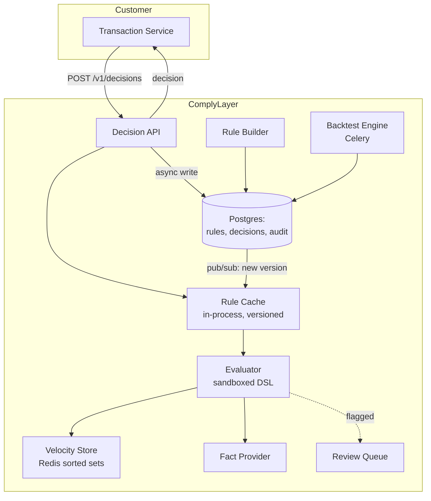

# ComplyLayer

### Pluggable Compliance Rules & Decision Engine for Fintechs

**Repository:** `github.com/complylayer/complylayer` — standalone project, independent release cycle
**Stack:** Python 3.12, Django 5, DRF, Redis, Postgres 16; React for the rule builder and dashboard
**Document type:** Complete product specification — business analysis, product management, architecture, engineering, security, DevOps
**Version:** 1.0

---

## 1. What ComplyLayer is

**One line:** ComplyLayer is a decision API a fintech calls before finalising any transaction. It returns `allow`, `flag` or `block` in under 100 milliseconds, based on rules the compliance officer writes and edits themselves — no engineer, no pull request, no deploy.

**Integration cost:** one API call added before the transaction commit, plus an explicit decision about fail-open or fail-closed behaviour.

**The core insight, and the entire product in one sentence:** *the person who owns the regulatory risk should be able to change the control without filing a ticket.*

### 1.1 Repository scope

Self-contained project with its own repository, versioning, release pipeline, dashboard and hosted deployment. It depends on no sibling product and nothing in this document lives outside this repository.

```
complylayer/
├── complylayer/              # the installable Django app (PyPI: complylayer)
│   ├── dsl/                  # parser, validator, interpreter — the security core
│   │   ├── parser.py
│   │   ├── validator.py      # AST allowlist
│   │   ├── interpreter.py    # no I/O, no imports, step budget
│   │   └── functions.py      # the allowed function set
│   ├── engine/               # rule cache, evaluation orchestration
│   ├── velocity/             # Redis sorted-set counters
│   ├── facts/                # aggregate fact provider
│   ├── api/                  # DRF — decision endpoint + management
│   ├── backtest/             # historical replay
│   ├── audit/                # append-only trail, hash chain
│   ├── tenancy/
│   ├── admin.py
│   └── migrations/
├── server/                   # standalone Django project wrapping the app
├── sdk/
│   ├── node/                 # @complylayer/node
│   ├── python/               # complylayer-client
│   └── go/                   # github.com/complylayer/complylayer-go
├── dashboard/                # React SPA — rule builder, review queue, analytics
├── deploy/{docker,helm,terraform}/
├── docs/adr/
└── .github/workflows/
```

---

## 2. Business analysis

### 2.1 The problem

Compliance logic — KYC tier limits, velocity caps, AML thresholds, high-risk corridor restrictions — is written into the transaction service as application code. The consequences follow inevitably.

| Consequence | Detail |
|---|---|
| **Change latency** | Adjusting a daily limit requires a ticket, a pull request, a review, a QA cycle and a deploy. Days at best. |
| **Ownership inversion** | The compliance officer is accountable for the rule but cannot see it, test it or change it. An engineer who has never read the regulation owns its implementation. |
| **Rule drift** | Regulations change; the code does not, because nobody remembers which service holds the constant |
| **No provenance** | Nobody can say who set the limit to ₦5,000,000, when, or why |
| **Untestable** | "What would have happened last month if this limit had been ₦2m?" is simply unanswerable |
| **Scattered** | Limits live in three services, a configuration file, and one hard-coded constant nobody has found yet |
| **Audit failure** | A regulator asks for the current rule set and its complete change history, and there is no single place that holds the answer |

### 2.2 Regulatory backdrop

KYC tiering imposes different transaction and balance limits per tier. AML obligations require monitoring for structuring, velocity anomalies and suspicious patterns, with reporting duties attached to what is found. These rules change, sometimes with short notice. A system that requires an engineering deploy to reflect a regulatory change will always be behind, and "we were mid-sprint" is not a defence anyone has ever successfully offered a supervisor.

### 2.3 Market position

Sardine and Unit21 built substantial businesses on exactly this shape: a decisioning layer beside the core system, with a rule builder aimed at risk and compliance teams rather than engineers. ComplyLayer is that pattern, scoped to a specific regulatory regime, with an immutable audit trail underneath and a hard latency contract on the front.

| Alternative | Why it falls short |
|---|---|
| Rules in application code (status quo) | Every problem in §2.1 |
| A configuration file or feature-flag service | No approval workflow, no backtesting, no velocity state, no audit trail |
| Build a rules engine in-house | The safe-evaluation problem is genuinely hard and usually solved with `eval`, which is remote code execution |
| Full fraud platform (enterprise) | Priced and scoped for institutions ten times the size |

### 2.4 Commercial model

| Tier | Target | Shape |
|---|---|---|
| Open core (self-hosted) | Evaluation, small teams | `pip install complylayer`, single tenant, community support |
| Starter | Early-stage fintech | Usage-priced per million decisions |
| Growth | Licensed fintech | + latency SLA, backtesting, approval workflows, SSO |
| Enterprise | Bank / PSSP | + on-premise, dedicated infrastructure, custom rule functions |

Billing metric is **decisions served**, which is directly countable by the customer from their own call volume.

### 2.5 Success criteria

| Metric | Before | With ComplyLayer |
|---|---|---|
| Time to change a compliance limit | 2–5 days | Under 5 minutes, by the person accountable for it |
| Who can change a rule | Engineers only | Compliance, through an approval workflow |
| Rule change provenance | None | Complete: who, when, why, previous value, approver |
| Ability to test a rule against history before activating | None | Backtest with impact report |
| Added latency on the transaction path | — | Under 100 ms at p99 |
| Single source of truth for all limits | No | Yes, versioned and exportable |

---

## 3. Product management

### 3.1 Personas

**Adaeze — Head of Compliance.** Non-technical but numerate. Accountable for every limit in the system. Wants to raise a tier-2 cap on a Friday afternoon and see exactly what it would have done last month before she commits.

**Emeka — Risk Manager.** Approves rule changes. Needs separation of duties to be real, not a policy document. Needs to know immediately when an emergency override is used.

**Tunde — Senior Backend Engineer.** Will add the call to the transaction path. His first question is what happens when ComplyLayer is down, and his second is how much latency this adds. Both answers must be immediate and specific.

**Ibrahim — Platform Engineer.** Will be paged on a latency breach. Needs the latency to be decomposable by stage or he cannot diagnose anything.

### 3.2 User stories

**Epic A — Decisioning**

> **A1.** As a backend engineer, I want a synchronous decision in under 100 ms, so a compliance check does not degrade my transaction flow.
> *AC:* p99 under 100 ms measured at the API edge. Hard server-side timeout at 150 ms. The SDK enforces a client timeout and applies the configured fallback.

> **A2.** As a backend engineer, I want documented, configurable behaviour when ComplyLayer is unreachable, so an outage in your system does not become an outage in mine — or a compliance breach in mine.
> *AC:* Per-tenant fail-open or fail-closed, configurable per rule severity. Fallback decisions are recorded and marked `degraded`. Default is fail-open for `flag` rules and fail-closed for `block` rules.

> **A3.** As a backend engineer, I want the decision to explain itself, so I can show the customer why and log it meaningfully.
> *AC:* The response includes the outcome, how many rules were evaluated, which matched, the reason, the rule set version and a decision ID.

> **A4.** As a backend engineer, I want idempotent decisions, so a retry does not produce a different answer or a duplicate audit record.
> *AC:* An idempotency key returns the original decision verbatim, including its original timestamp.

**Epic B — Rule authoring**

> **B1.** As a compliance officer, I want to create and edit rules without an engineer.
> *AC:* A visual builder for common patterns, plus an expression editor for complex logic. Syntax validated on save with a clear error. Rules are versioned.

> **B2.** As a compliance officer, I want to test a rule against historical transactions before activating it.
> *AC:* Backtest runs against the last N days and reports how many transactions would have been blocked or flagged, with a drill-down sample of each.

> **B3.** As a compliance officer, I want to run a rule in shadow mode, so I can observe it in production without affecting a single customer.
> *AC:* Shadow rules are evaluated and recorded but never influence the returned decision. Shadow-versus-live divergence is reported.

> **B4.** As a risk manager, I want rule changes to require approval, so no single person can unilaterally weaken a control.
> *AC:* Configurable approval workflow. The author cannot self-approve. Approval is an audit record. An emergency override exists, requires a written reason, and alerts the risk lead immediately.

> **B5.** As a compliance officer, I want a library of pre-built rules mapped to specific regulations, so I start from a correct baseline rather than a blank page.
> *AC:* Templates for KYC tier limits, velocity caps, structuring detection, dormant-account reactivation and high-risk corridors, each annotated with the regulation it implements.

**Epic C — Velocity and patterns**

> **C1.** As a compliance officer, I want rules over a rolling window, such as more than five transactions above ₦500,000 in one hour.
> *AC:* Windows from one minute to thirty days, evaluated within the latency budget, accurate under concurrency.

> **C2.** As a compliance officer, I want structuring detection — many transactions sitting just under a reporting threshold.
> *AC:* Detects N transactions within X% below a threshold over a window. Configurable and shipped as a template.

> **C3.** As a compliance officer, I want rules that consider a customer's history, not only the current transaction.
> *AC:* Aggregate facts available in the evaluation context: lifetime volume, account age, prior flag count, average transaction size, days since last activity.

**Epic D — Oversight**

> **D1.** As a compliance officer, I want a queue of flagged transactions to review with full context and a recorded outcome.
> **D2.** As a risk manager, I want per-rule analytics: fire rate, false-positive rate derived from review outcomes, and latency contribution.
> **D3.** As a compliance officer, I want a regulator-ready export of the rule set, its complete change history and decision volumes.

### 3.3 Scope for v1.0

| Must | Should | Could | Won't (v1) |
|---|---|---|---|
| Decision API under 100 ms p99 | Visual rule builder | Machine-learning risk scoring | Executing blocks — the customer's system does that |
| Rules DSL with a safe evaluator | Backtesting | Rule suggestions from observed patterns | Sanctions list data — integrate, don't own |
| Velocity rules over rolling windows | Shadow mode | Graph-based network analysis | Identity verification or KYC document checks |
| Rule versioning and approval workflow | Review queue | | Case management |
| Fail-open/fail-closed policy | Rule templates | | |
| Immutable decision audit trail | Analytics and export | | |
| Multi-tenancy and isolation | | | |

### 3.4 Non-functional requirements

| NFR | Target | Why it matters |
|---|---|---|
| p50 decision latency | < 20 ms | It sits on the critical path of every transaction |
| p99 decision latency | < 100 ms | The hard product promise the integration was sold on |
| Availability | 99.95% | Fail-closed rules turn downtime into a transaction outage |
| Throughput | 2,000 decisions/sec per region | |
| Rule activation propagation | < 30 s across all nodes | A compliance change must take effect promptly and uniformly |
| **Decision reproducibility** | 100% | Given the same input and rule set version, the same output — always |

**Reproducibility is the subtlest requirement here.** It means the evaluated rule set version must be recorded with every decision, and rule set versions must be immutable snapshots rather than foreign keys to mutable rows. Without it you cannot answer "why was this transaction allowed six months ago?" — which is precisely the question that gets asked.

---

## 4. Architecture

### 4.1 Components



### 4.2 The latency budget

```
Total budget: 100 ms p99, measured at the API edge

  Auth and request validation       3 ms
  Rule set lookup                   0 ms   ← in-process cache, versioned, hot
  Fact gathering                   15 ms   ← ONE pipelined Redis round trip
  Rule evaluation (N rules)         5 ms   ← pure computation, zero I/O
  Response serialisation            2 ms
  ─────────────────────────────────────
  Synchronous total                25 ms
  Headroom                         75 ms

  Audit write                    async     ← queued, never blocks the response
  Review queue insert            async
  Metrics emission               async
```

Three decisions make this work, each defensible on its own:

1. **Rules are cached in-process, never fetched per request.** Each node holds the compiled rule set in memory keyed by version. A Redis pub/sub message announces a new version; nodes reload in the background and swap atomically. A database round trip for rules would consume the entire budget by itself.
2. **Fact gathering is one pipelined Redis round trip.** Every velocity counter and aggregate for the customer is fetched together. N sequential lookups is the standard way this architecture fails, and it fails gradually rather than obviously.
3. **The audit write is asynchronous.** The decision returns, then persists. The trade-off is real: a crash in that window could lose an audit record. It is mitigated by writing to a durable local queue before responding and reconciling on startup. **Naming the trade-off rather than pretending it does not exist is the point** — an engineer who claims a system has no trade-offs has not found them yet.

### 4.3 The rules DSL — and why not `eval`

The tempting implementation is `eval(rule.expression, context)`. That is remote code execution shipped as a product feature, and it is the single most dangerous shortcut available in this project.

**The implementation instead: parse to an AST, validate against an allowlist, and evaluate with an interpreter that has no I/O, no imports, no attribute access and a step budget.**

```python
import ast

ALLOWED_NODES = {
    ast.Expression, ast.BoolOp, ast.BinOp, ast.UnaryOp, ast.Compare,
    ast.Name, ast.Load, ast.Constant, ast.And, ast.Or, ast.Not,
    ast.Eq, ast.NotEq, ast.Lt, ast.LtE, ast.Gt, ast.GtE, ast.In, ast.NotIn,
    ast.Add, ast.Sub, ast.Mult, ast.Div, ast.Mod,
    ast.Call, ast.List, ast.Tuple, ast.keyword,
}

ALLOWED_FUNCTIONS = {
    'velocity_count', 'velocity_sum', 'days_since', 'in_list',
    'hour_of_day', 'abs', 'min', 'max', 'percent_of',
}

MAX_NODES = 200      # complexity ceiling, enforced at parse time
MAX_STEPS = 1000     # evaluation step budget, enforced at run time


class RuleValidator(ast.NodeVisitor):
    """Reject anything not explicitly permitted.

    An allowlist is the only defensible approach here. Denylists of dangerous
    constructs are always incomplete — the sandbox-escape literature is a long
    history of denylists that missed one thing.
    """

    def generic_visit(self, node):
        if type(node) not in ALLOWED_NODES:
            raise RuleSyntaxError(f"'{type(node).__name__}' is not permitted in rules")
        super().generic_visit(node)

    def visit_Call(self, node):
        if not isinstance(node.func, ast.Name):
            raise RuleSyntaxError("Only direct function calls are permitted")
        if node.func.id not in ALLOWED_FUNCTIONS:
            raise RuleSyntaxError(f"Unknown function '{node.func.id}'")
        self.generic_visit(node)

    # Explicitly blocked, each with a clear message rather than a mysterious failure:
    def visit_Attribute(self, node):
        # Blocks the entire __class__ / __bases__ / __subclasses__ escape family
        raise RuleSyntaxError("Attribute access is not permitted in rules")

    def visit_Subscript(self, node):
        raise RuleSyntaxError("Indexing is not permitted in rules")

    def visit_Lambda(self, node):
        raise RuleSyntaxError("Lambdas are not permitted in rules")

    def visit_Import(self, node):
        raise RuleSyntaxError("Imports are not permitted in rules")

    def visit_Comprehension(self, node):
        raise RuleSyntaxError("Comprehensions are not permitted in rules")
```

Rules compile once at load time and are cached as validated ASTs. Evaluation walks the tree with an interpreter that resolves names only from the supplied fact context. **There is no path from a rule expression to the filesystem, the network, the ORM or the Python runtime.**

### 4.4 What rules look like

```python
# KYC tier daily limit
amount_minor > tier_daily_limit_minor

# Velocity: more than five large transactions in an hour
velocity_count(window='1h', min_amount_minor=50_000_000) > 5

# Structuring: repeated transactions just below the reporting threshold
velocity_count(window='24h',
               min_amount_minor=percent_of(reporting_threshold_minor, 90),
               max_amount_minor=reporting_threshold_minor) >= 3

# Dormant account reactivated with a large transfer
days_since(last_transaction_at) > 90 and amount_minor > 20_000_000

# High-risk corridor, outside business hours, low KYC tier
in_list(destination_country, high_risk_countries)
    and kyc_tier < 3
    and (hour_of_day < 6 or hour_of_day > 22)

# New account, large first transaction
days_since(account_created_at) < 7 and amount_minor > 10_000_000
```

Readable by a compliance officer, safe to evaluate, expressive enough for real regulatory rules. Holding those three properties together is the actual design problem, and it is worth saying so in a review.

### 4.5 Velocity counters

```python
# Redis sorted sets: member = transaction id, score = unix timestamp.
# One pipeline covers every window in a single round trip.
def gather_velocity(r, tenant, customer_hash, windows):
    now = time.time()
    pipe = r.pipeline()
    for w in windows:
        key = f"v:{tenant}:{customer_hash}:{w}"
        pipe.zremrangebyscore(key, 0, now - WINDOW_SECONDS[w])   # trim expired
        pipe.zrange(key, 0, -1)
    return pipe.execute()
```

Amounts live in a parallel hash so `velocity_sum` and amount-filtered counts need no second trip. Keys carry a TTL slightly longer than the largest window, so dormant customers expire on their own rather than accumulating forever.

**Consistency trade-off, stated openly.** Velocity counters are eventually consistent under concurrent transactions for the same customer. Two simultaneous transactions may each observe a count of 4 and both pass a "no more than 5" rule. For `block`-severity rules this is mitigated with a short per-customer Redis lock costing roughly 5 ms, well inside the budget. For `flag`-severity rules the imprecision is accepted and documented, because a flag is reviewed by a human anyway.

Choosing *where* to pay for strictness, rather than applying it uniformly or ignoring it entirely, is the correct engineering answer — and being able to state exactly where the system is imprecise is far more convincing than claiming it is perfect everywhere.

---

## 5. Data model

```python
class Rule(models.Model):
    id = models.CharField(primary_key=True, max_length=32)      # rul_...
    tenant = models.ForeignKey(Tenant, on_delete=models.PROTECT)
    name = models.CharField(max_length=128)
    description = models.TextField()
    category = models.CharField(max_length=64)         # kyc|velocity|aml|fraud
    regulatory_reference = models.CharField(max_length=255, blank=True)

    expression = models.TextField()
    severity = models.CharField(max_length=16)         # block|flag|allow_with_note
    priority = models.IntegerField(default=0)          # evaluation order
    applies_to = models.JSONField(default=dict)        # scoping filters

    state = models.CharField(max_length=16)            # draft|shadow|active|archived
    version = models.PositiveIntegerField(default=1)

    created_by = models.CharField(max_length=64)
    approved_by = models.CharField(max_length=64, blank=True)
    approved_at = models.DateTimeField(null=True)
    activated_at = models.DateTimeField(null=True)

    objects = TenantScopedManager()

    class Meta:
        unique_together = [('tenant', 'name', 'version')]


class RuleSetVersion(models.Model):
    """An immutable snapshot of every active rule at a moment in time.

    Decisions reference this rather than the Rule rows, which is what makes a
    decision reproducible after the underlying rules have changed.
    """
    tenant = models.ForeignKey(Tenant, on_delete=models.PROTECT)
    version = models.PositiveIntegerField()
    rules_snapshot = models.JSONField()        # a full frozen copy, not foreign keys
    published_at = models.DateTimeField(auto_now_add=True)
    published_by = models.CharField(max_length=64)

    class Meta:
        unique_together = [('tenant', 'version')]


class Decision(models.Model):
    id = models.CharField(primary_key=True, max_length=32)      # dec_...
    tenant = models.ForeignKey(Tenant, on_delete=models.PROTECT)
    idempotency_key = models.CharField(max_length=128)
    ruleset_version = models.PositiveIntegerField()             # reproducibility

    transaction_ref = models.CharField(max_length=128, db_index=True)
    customer_ref_hash = models.CharField(max_length=64, db_index=True)
    amount_minor = models.BigIntegerField()
    currency = models.CharField(max_length=3)
    context = models.JSONField()               # the full input, so it can be replayed

    outcome = models.CharField(max_length=16)  # allow|flag|block
    matched_rules = models.JSONField(default=list)
    shadow_matches = models.JSONField(default=list)
    reason = models.TextField(blank=True)
    degraded = models.BooleanField(default=False)   # a fallback was used

    latency_ms = models.PositiveIntegerField()
    decided_at = models.DateTimeField(db_index=True)

    review_status = models.CharField(max_length=16, blank=True)
    reviewed_by = models.CharField(max_length=64, blank=True)
    review_notes = models.TextField(blank=True)

    class Meta:
        unique_together = [('tenant', 'idempotency_key')]
        indexes = [
            models.Index(fields=['tenant', 'outcome', 'decided_at']),
            models.Index(fields=['tenant', 'review_status', 'decided_at']),
        ]
```

Storing the complete `context` makes every decision replayable against any rule set version. That single field is what powers backtesting, shadow-mode divergence reporting, and the ability to answer a regulator's "what would this proposed rule have done?" without a data science project.

---

## 6. Installation and distribution

ComplyLayer ships in three forms: hosted, as an installable Django app, and as a standalone self-hosted service. Because it sits on the critical path, a meaningful number of customers will want it inside their own network — so self-hosting is a first-class path, not a grudging concession.

### 6.1 Hosted

Sign in at `app.complylayer.dev`, create a project, copy the API key, start from a rule template. First decision served in under ten minutes.

### 6.2 As an installable Django app

```bash
pip install complylayer
```

```python
# settings.py
INSTALLED_APPS = [
    ...
    "rest_framework",
    "complylayer",
]

COMPLYLAYER = {
    "TENANT_MODEL": "accounts.Organisation",
    "REDIS_URL": "redis://localhost:6379/2",
    "DEFAULT_FALLBACK": {"block": "closed", "flag": "open"},   # explicit, always
    "MAX_EVAL_STEPS": 1000,
    "DECISION_TIMEOUT_MS": 150,
}
```

```python
# urls.py
urlpatterns = [path("comply/", include("complylayer.urls"))]
```

```bash
python manage.py migrate complylayer
python manage.py complylayer_init          # seeds rule templates and categories
python manage.py complylayer_doctor        # DB grants, audit trigger, Redis latency, clock skew
python manage.py complylayer_benchmark     # measures local p99 against a synthetic load
```

For teams who want to call it in-process rather than over HTTP — which removes the network hop entirely and is the lowest-latency option available:

```python
from complylayer import evaluate

decision = evaluate(
    tenant=org,
    transaction_ref=txn.id,
    customer_ref=txn.user_id,
    amount_minor=txn.amount_minor,
    currency="NGN",
    customer={"kyc_tier": txn.user.kyc_tier,
              "account_created_at": txn.user.created_at},
)
if decision.outcome == "block":
    raise ComplianceBlocked(decision.customer_message, decision.id)
```

`complylayer_benchmark` exists because the latency promise is the product. A self-hosted deployment on undersized infrastructure, or with Redis in another availability zone, will not meet it — and the customer should discover that during installation rather than during an incident.

### 6.3 Self-hosted standalone service

```bash
docker run -d --name complylayer \
  -e COMPLYLAYER_DATABASE_URL="postgres://..." \
  -e COMPLYLAYER_REDIS_URL="redis://..." \
  -e COMPLYLAYER_SECRET_KEY_REF="kms://..." \
  -p 8000:8000 \
  ghcr.io/complylayer/complylayer:1.0.0
```

```bash
curl -fsSL https://get.complylayer.dev/compose.yml -o docker-compose.yml
docker compose up
# Postgres, Redis, decision API, management API, Celery, dashboard

helm repo add complylayer https://charts.complylayer.dev
helm install complylayer complylayer/complylayer -f values.yaml
# Deploys decision and management workloads separately — see §11.1
```

### 6.4 Client SDKs

```bash
npm install @complylayer/node
pip install complylayer-client
go get github.com/complylayer/complylayer-go
```

```js
import { ComplyLayer } from '@complylayer/node';

const comply = new ComplyLayer({
  apiKey: process.env.COMPLYLAYER_KEY,
  timeout: 150,
  fallback: 'allow',     // REQUIRED. There is no default.
});

async function executeTransfer(txn) {
  const decision = await comply.check({
    transactionRef: txn.id,
    customerRef: txn.userId,
    amountMinor: txn.amountMinor,
    currency: 'NGN',
    transactionType: 'transfer',
    customer: { kycTier: txn.user.kycTier, accountCreatedAt: txn.user.createdAt },
    destination: { country: txn.destCountry, bankCode: txn.destBank },
  });

  if (decision.outcome === 'block') {
    throw new ComplianceBlockedError(decision.customerMessage, decision.decisionId);
  }
  // 'flag' proceeds — it is already sitting in the compliance review queue.
  return ledger.transfer(txn);
}
```

**`fallback` is a required constructor argument with no default.** Forcing an explicit choice at integration time is better than a silent default that a fintech discovers the meaning of during an outage. This is a small API design decision that prevents a specific, serious failure.

### 6.5 The dashboard

`app.complylayer.dev`, or wherever a self-hosted deployment serves it. The rule builder is the product's centre of gravity — it is the surface a compliance officer uses daily, and it is the reason the engineer is no longer in the loop.

| Section | For | Contents |
|---|---|---|
| **Rule builder** | Compliance | Visual builder for common patterns and an expression editor for complex logic; live syntax validation; template library annotated with regulatory references |
| **Backtest** | Compliance | Run a draft rule against the last N days; see how many transactions would have been blocked or flagged, with drill-down samples |
| **Shadow** | Compliance, Risk | Rules evaluating in production without effect; divergence between shadow and live outcomes |
| **Approvals** | Risk | Pending rule changes with before/after diff; approve or reject with a reason; author cannot self-approve |
| **Review queue** | Compliance | Flagged transactions with full context and matched rules; clear or confirm, with the outcome feeding false-positive analytics |
| **Rule analytics** | Risk | Fire rate per rule, false-positive rate from review outcomes, latency contribution per rule |
| **Decisions** | Everyone | Searchable decision log with the rule set version, matched rules and full input context |
| **Reports** | Compliance | Rule set export with complete change history, decision volumes, audit-chain attestation |
| **Settings** | Owners | API keys, fallback policy, team, SSO, retention |

Authentication is email plus TOTP, or OIDC. Roles implement genuine separation of duties — see §10.2.

---

## 7. API contract

### 7.1 The decision call

```http
POST /v1/decisions
Authorization: Bearer cl_live_...
Idempotency-Key: TXN-2026-08-11-8842

{
  "transaction_ref": "TXN-2026-08-11-8842",
  "customer_ref": "usr_9931",
  "amount_minor": 75000000,
  "currency": "NGN",
  "transaction_type": "transfer",
  "channel": "mobile",
  "customer": {
    "kyc_tier": 2,
    "account_created_at": "2026-07-30T10:00:00Z",
    "country": "NG"
  },
  "destination": { "country": "NG", "bank_code": "058", "is_new_beneficiary": true },
  "device": { "id": "dev_a83f", "ip_country": "NG" }
}

200 OK   (18 ms)
{
  "decision_id": "dec_01HQ...",
  "outcome": "flag",
  "reason": "Transaction exceeds tier 2 single-transaction limit",
  "matched_rules": [
    { "id": "rul_kyc_t2_single",
      "name": "Tier 2 single transaction limit",
      "severity": "flag",
      "regulatory_reference": "CBN KYC Tier 2" }
  ],
  "evaluated_rules": 14,
  "ruleset_version": 47,
  "latency_ms": 18,
  "degraded": false
}
```

A `block` outcome carries an additional `customer_message` field written by the compliance team in the rule builder, so the wording a customer sees is controlled by the people accountable for it rather than hard-coded by an engineer.

### 7.2 Rule management

```http
GET    /v1/rules
POST   /v1/rules                        # created as draft
POST   /v1/rules/validate               # syntax check without saving
POST   /v1/rules/{id}/backtest          # {"from": "...", "to": "..."}
POST   /v1/rules/{id}/shadow
POST   /v1/rules/{id}/request-approval
POST   /v1/rules/{id}/approve           # rejected if the actor is the author
POST   /v1/rules/{id}/activate
POST   /v1/rules/{id}/archive
GET    /v1/rules/templates
GET    /v1/rulesets/{version}           # immutable snapshot

GET    /v1/decisions?outcome=&review_status=&from=&to=&cursor=
GET    /v1/decisions/{id}
POST   /v1/decisions/{id}/review        # {"status": "cleared", "notes": "..."}
POST   /v1/decisions/{id}/replay        # re-evaluate against another ruleset version

GET    /v1/analytics/rule-performance?from=&to=
GET    /v1/reports/compliance?from=&to=&format=csv|pdf
GET    /v1/audit/verify
GET    /healthz   GET /readyz   GET /metrics
```

Full OpenAPI 3.1 specification at `docs/openapi.yaml`.

---
## 8. Foundations

> These are the ComplyLayer project's own foundations. This document is self-contained — it assumes no shared platform, no sibling services and no external repository. Everything ComplyLayer needs to run is defined in this repository.

### 8.1 Tenancy model

ComplyLayer is multi-tenant from the first commit, even if it launches with one customer. Retrofitting tenancy is a rewrite; building it in costs a day.

Tenancy is enforced at three independent layers, because one layer is a single point of failure:

1. **Authentication layer** — an API key resolves to exactly one `tenant_id`. No key spans tenants. Ever.
2. **Query layer** — every model uses a `TenantScopedManager` whose `get_queryset()` raises unless a tenant context has been set, and the rule cache is keyed by tenant so one tenant's compiled rules can never be reached from another's evaluation context.
3. **Storage layer** — Postgres Row Level Security policies keyed on a session variable set from the authenticated tenant, so even a query that forgets to scope returns nothing.

**Mandatory test:** `tests/test_tenant_isolation.py` creates two tenants, writes data as A, and asserts that every read endpoint returns **404** when called as B. Not 403 — a 403 confirms the resource exists, which is an information leak. This suite is a required CI gate and blocks merge.

### 8.2 Authentication and keys

| Surface | Scheme |
|---|---|
| Server-to-server API | Bearer API key, format `cl_{env}_{random32}` — e.g. `cl_live_9f2a7c...` |
| Key storage | Argon2id hash. Prefix stored in plaintext for lookup and dashboard display. Shown once at creation, never retrievable. |
| Outbound webhooks | HMAC-SHA256 over `{timestamp}.{raw_body}`, header `X-ComplyLayer-Signature: t=...,v1=...`. Deliberately the Stripe scheme — well documented, widely understood, and not a novel cryptographic design. |
| Dashboard | Email + TOTP, or OIDC against the tenant's IdP. Short sessions, rotated on privilege change. |
| Key rotation | Overlapping validity windows. A new key is issued and both work until the old one is explicitly revoked, so rotation never causes downtime. |

Keys are scoped per environment (`test` / `live`) and are independently revocable. A leaked test key can do nothing to live data.

### 8.3 The audit trail

Every state change in ComplyLayer is recorded as an immutable audit record. This is the difference between a system that logs and a system that produces evidence.

```json
{
  "id": "aud_01HQ...",
  "tenant_id": "tnt_...",
  "event_type": "rule.activated",
  "occurred_at": "2026-08-11T09:14:22.481Z",
  "recorded_at": "2026-08-11T09:14:22.503Z",
  "actor":   { "type": "system|user|api_key", "id": "...", "ip": "..." },
  "subject": { "type": "...", "id": "..." },
  "payload": { },
  "prev_hash": "sha256:...",
  "hash": "sha256:..."
}
```

**Immutability is enforced, not promised:**

- The application database role has `INSERT` and `SELECT` grants on the audit table only. No `UPDATE`, no `DELETE`.
- A `BEFORE UPDATE OR DELETE` trigger raises an exception regardless of the role attempting it, so even a superuser mistake fails loudly.
- Each record's `hash` covers its own content plus the previous record's hash, forming a per-tenant hash chain. Tampering anywhere invalidates every record after it.
- A nightly job walks each tenant's chain and publishes a signed checkpoint. `GET /v1/audit/verify` exposes the proof so a customer or their auditor can check it independently.
- Audit records are replicated to object storage with a write-once lock, so immutability survives a full database compromise.
- **Corrections are appended, never applied.** A wrong record is followed by a compensating record with `corrects: <id>`. The original stays.

### 8.4 Data classification

| Class | Examples | Rule |
|---|---|---|
| **Never collect** | PAN, CVV, full card data, passwords, full BVN | The SDK strips these at source via a field denylist. The server independently rejects any payload containing a 13–19 digit string that passes a Luhn check. |
| **Pseudonymise** | Customer name, email, phone | Hashed with a per-tenant salt before storage unless the tenant explicitly opts in |
| **Store encrypted** | Transaction references, amounts, currencies, KYC tiers, decision inputs, matched rules, review outcomes | Encrypted at rest with envelope encryption — a KMS master key wraps per-tenant data keys |
| **Standard** | Aggregates, configuration, rule definitions | Normal storage |

This is the section a prospective customer's security team reads first. *"We cannot leak what we never collected"* is a far stronger position than *"we encrypt it well."*

### 8.5 Security baseline

**Secrets**
- No secrets in source. `gitleaks` runs in pre-commit and as a blocking CI gate.
- Runtime secrets come from the cloud secret manager, injected as env vars or mounted files, never baked into an image.
- Every secret type has a documented maximum age and a rotation runbook.

**Secure SDLC**

| Stage | Gate |
|---|---|
| Design | Threat model updated whenever a new external interface is added |
| Pre-commit | Format, lint, `gitleaks` |
| Pull request | SAST (`bandit`, `semgrep`), dependency audit (`pip-audit`), unit tests, tenant isolation suite, coverage floor |
| Merge | Container image scan (`trivy`), SBOM generation (`syft`), image signing (`cosign`) |
| Deploy | Migrations reviewed as a separate artefact from code; canary rollout with automatic rollback on error-budget burn |
| Runtime | Nightly audit-chain verification; weekly DAST against staging |

**Dependency and vulnerability management**

ComplyLayer's own dependency tree is scanned on every build against OSV and NVD. Findings are triaged against published remediation SLAs, which are stated publicly because a vendor that publishes its SLAs is easier to trust than one that does not:

| Severity | Remediation SLA |
|---|---|
| Critical | 24 hours |
| High | 7 days |
| Medium | 30 days |
| Low | 90 days |

An SBOM is generated per release and published as a build artefact, so a customer's security team can assess ComplyLayer without asking.

### 8.6 Reliability principles

1. **Degrade, never block.** ComplyLayer sits on the critical path, so it cannot simply be asynchronous. Instead the failure mode is made explicit and configurable per rule severity — fail-closed for `block`, fail-open for `flag` (§10.3) — and every degraded decision is recorded and alerted on rather than passing silently.
2. **Bounded everything.** Every queue, buffer, retry sequence and payload has an explicit ceiling. Unbounded growth is the most common cause of a 3am page.
3. **Backpressure is explicit.** When capacity is exceeded the system returns 429 with `Retry-After` rather than silently queueing until it dies.
4. **Idempotency everywhere.** Every write endpoint accepts an idempotency key and returns the original result on replay.
5. **Graceful shutdown.** On `SIGTERM`: stop accepting work, drain in-flight requests, flush buffers, exit. `terminationGracePeriodSeconds` is set longer than the drain budget.

---

## 9. Compliance mapping

| Requirement | Source | How ComplyLayer addresses it |
|---|---|---|
| KYC tiering and transaction limits | CBN KYC regulations | Rules engine enforces per-tier caps at decision time, with each rule annotated with the regulation it implements (§4.4) |
| AML transaction monitoring and suspicious pattern detection | AML regulations / NFIU obligations | Velocity rules, structuring detection templates, flagged-transaction review queue with recorded outcomes (§3.2) |
| Evidence of which controls were in force at a given time | Supervisory expectation | Immutable rule set version snapshots referenced by every decision, making any historical decision reproducible (§3.4) |
| Separation of duties over control changes | ISO 27001 A.9.2, SOC 2 CC6 | Approval workflow where the author cannot self-approve and engineers cannot activate rules at all (§10.2) |
| Audit trail integrity | ISO 27001 A.12.4, SOC 2 CC7 | Append-only store, hash chain, signed checkpoints, object-lock replication (§8.3) |
| Access control and separation of duties | ISO 27001 A.9, SOC 2 CC6 | Role-based permissions, per-environment key scoping, TOTP/OIDC on the dashboard |
| Change management | SOC 2 CC8 | PR review, separated migrations, staged deploys, every deployment recorded |
| Vulnerability management | ISO 27001 A.12.6, SOC 2 CC7.1 | Blocking CI gates, published remediation SLAs, per-release SBOM (§8.5) |
| Data protection and subject rights | NDPR / GDPR | Data minimisation (§8.4), documented and tested export and deletion procedures, 72-hour breach notification runbook |
| Cardholder data | PCI-DSS | **Out of scope by design.** Card data is never collected. This is documented as a deliberate scope-reduction argument, not an omission. |

---

## 10. Threat model

General controls are in §8. These are specific to what ComplyLayer does.

| Threat | Risk | Control |
|---|---|---|
| **Remote code execution via a rule expression** | Critical | AST allowlist; no attribute access, no subscript, no lambda, no comprehension, no import; step budget; node-count ceiling. **Never `eval`.** Fuzzed in CI against a corpus of published Python sandbox escapes. |
| Denial of service via a pathological rule | High | Node count capped at parse time, step budget capped at run time, per-rule timeout, total evaluation timeout |
| **Unauthorised weakening of a control** | Critical | Approval workflow with real separation of duties; the author cannot self-approve; every change audited with a before/after diff; emergency override requires a written reason and pages the risk lead |
| Decision tampering after the fact | Critical | Decisions are append-only and hash-chained; `ruleset_version` freezes exactly what was evaluated |
| Probing the API to learn thresholds | High | Rate limiting per customer reference; `block` responses never reveal the numeric threshold; a built-in anomaly rule detects sequential probing patterns |
| Velocity counter manipulation | High | Counters are keyed server-side from the authenticated tenant and customer hash. The client cannot supply, seed or reset them. |
| Sensitive PII in the decision context | Medium | A documented field allowlist; the SDK strips unknown fields; PAN pattern detection rejects the request outright rather than storing and redacting |
| **Fail-open abused as a deliberate bypass** | High | Every degraded decision is recorded and counted. A sustained degraded rate is a paging alert, never a silent condition — otherwise "just take ComplyLayer down" becomes a way to move money past the controls. |
| Timing side channel revealing rule structure | Low | Evaluation order is constant per rule set version; response timing is padded to a floor |
| Cross-tenant rule or decision visibility | Critical | Three-layer isolation per §8.1, with the mandatory isolation suite |

### 10.1 The sandbox is the product's security core

Everything else in this document is ordinary good practice. The rule evaluator is the part where getting it wrong is catastrophic and where the naive implementation is not merely suboptimal but is literally remote code execution offered as a feature.

The mitigations, in order of importance:

1. **Allowlist, never denylist.** The history of Python sandbox escapes is a history of denylists that missed one construct. `ALLOWED_NODES` is the entire permitted grammar; everything else raises.
2. **No attribute access.** This single prohibition eliminates the whole `__class__` → `__bases__` → `__subclasses__` escape family, which is how almost every published Python sandbox escape begins.
3. **No indexing, no lambdas, no comprehensions.** Each closes a different escape route, and none is needed to express a compliance rule.
4. **A step budget.** Even a fully valid expression cannot run forever.
5. **Fuzzing as a required CI gate.** The escape corpus is a checked-in test file. Every entry must raise `RuleSyntaxError`, and a new escape published anywhere gets added to it.

Writing that test suite *before* the evaluator exists — see §12 — makes the security requirement the specification rather than an afterthought.

### 10.2 Separation of duties

| Role | Create draft | Backtest | Shadow | Approve | Activate | Emergency override |
|---|---|---|---|---|---|---|
| Compliance Analyst | ✅ | ✅ | ✅ | ❌ | ❌ | ❌ |
| Compliance Officer | ✅ | ✅ | ✅ | ✅ (not own) | ✅ | ❌ |
| Risk Manager | ✅ | ✅ | ✅ | ✅ | ✅ | ✅ |
| Engineer | ❌ | ✅ | ❌ | ❌ | ❌ | ❌ |
| Auditor (read-only) | ❌ | ✅ | ❌ | ❌ | ❌ | ❌ |

**The engineer role cannot create or activate a compliance rule.** That is not an oversight in the permission table — it is the entire point of the product, and it belongs in the documentation stated exactly that plainly.

### 10.3 Fail-open versus fail-closed

A product decision with security consequences, so it is documented rather than defaulted silently.

| Rule severity | Default when ComplyLayer is unreachable | Rationale |
|---|---|---|
| `block` | **Fail-closed** | A blocked transaction is one that regulation says must not happen. Allowing it during an outage is a compliance breach, and "our vendor was down" is not a defence. |
| `flag` | **Fail-open** | Flagging exists for human review, not prevention. Halting all transactions because the review system is unavailable is disproportionate to the risk. |

A tenant may override either default, but must do so explicitly, and the choice is recorded as an audit event. Every degraded decision is audited so the review queue can be backfilled once service returns — an outage should not create a permanent gap in the review record.

---

## 11. Operations

### 11.1 Deployment shape

The latency contract dictates the topology, and every element of it exists for a stated reason:

- **Co-locate with Redis.** Same availability zone, no cross-AZ hop for fact gathering. A cross-AZ round trip alone can consume half the budget.
- **Separate the decision workload from the management workload.** Deployed as distinct workloads from the same codebase, so a heavy backtest or export cannot starve the decision API.
- **Analytics on a read replica.** Backtests, reports and dashboard queries never touch the database serving decisions.
- **Warm start.** A new pod loads and compiles the rule set before reporting ready. A pod serving traffic before its cache is warm produces a latency spike on every single deploy.
- **Redis with a replica and automatic failover.** Redis is a hard dependency for velocity rules, and its failure mode must be understood in advance: on total Redis loss, velocity rules cannot evaluate and the configured fallback applies per severity.

### 11.2 Metrics

```
complylayer_decisions_total{tenant,outcome}
complylayer_decision_duration_seconds{outcome}            # THE metric
complylayer_decision_duration_by_stage_seconds{stage}     # auth|facts|eval|serialize
complylayer_rules_evaluated_per_decision
complylayer_rule_match_total{rule_id,severity}
complylayer_rule_eval_duration_seconds{rule_id}
complylayer_shadow_divergence_total{rule_id}
complylayer_degraded_decisions_total{reason}
complylayer_ruleset_version{tenant}                       # gauge, per pod
complylayer_redis_latency_seconds
complylayer_rule_changes_total{action,actor}
complylayer_review_queue_depth{tenant}
complylayer_audit_chain_verified_at
```

Two of these deserve specific attention.

`complylayer_decision_duration_by_stage_seconds` exists because a p99 alert with no stage breakdown is undiagnosable at 3am. Instrumenting the stages costs almost nothing and turns a twenty-minute investigation into a thirty-second one.

`complylayer_ruleset_version` as a per-pod gauge catches the worst silent failure the system can have: one pod missed the pub/sub message and is serving decisions from a stale rule set. Nothing errors, latency is fine, the dashboard looks healthy, and a fraction of traffic is being evaluated against rules that were retired last week. Any variance across pods for more than 60 seconds pages immediately.

### 11.3 Service level objectives

| SLI | SLO |
|---|---|
| Decision API availability | 99.95% |
| Decision p50 latency | < 20 ms |
| Decision p99 latency | < 100 ms |
| Rule activation propagation | < 30 s, 99.9% of the time |
| Degraded decision rate | < 0.05% |

**Error budget policy:** at 50% budget consumption within a quarter, feature work stops and reliability work starts. For ComplyLayer specifically, degraded-decision rate is treated as an availability metric rather than a quality metric, because a degraded decision is a compliance control that did not run.

### 11.4 Alerts

| Alert | Condition | Severity | First action |
|---|---|---|---|
| Latency budget breach | p99 > 100 ms for 2 m | Page | See runbook 11.5 |
| Degraded decisions | rate > 0.1% for 5 m | Page | Compliance controls are not being applied — treat as an incident, not a blip |
| **Rule version skew** | variance across pods > 60 s | Page | Some traffic is being evaluated against stale rules |
| Redis latency | p99 > 20 ms | Page | The latency budget is about to fail |
| Block rate anomaly | outside 3σ of the 7-day baseline | Warn | A recent rule change may have misfired |
| **Emergency override used** | any occurrence | Page risk lead | A control was changed outside the approval workflow |
| Slow rule | any rule p99 eval > 5 ms | Warn | One rule is consuming the shared budget |
| Review queue growth | depth > 500 | Warn | Flags are outpacing reviewer capacity |
| Audit chain broken | nightly verification fails | Page | Security incident |

### 11.5 Runbook — p99 latency breach

1. Check `decision_duration_by_stage_seconds`. The stage histogram localises the problem immediately, which is the entire reason it exists.
2. **Facts stage high** → Redis latency, connection pool exhaustion, or a customer with an enormous velocity set. Check sorted-set cardinality: a single very high-volume customer can degrade the shared window operation for everyone.
3. **Eval stage high** → check `rule_eval_duration_seconds` by rule. A newly activated rule with an expensive expression is by far the most common cause. Move it to shadow, confirm latency recovers, then work with the author on a cheaper formulation.
4. **Auth stage high** → key-hash verification cost or contention on key lookup. Verify the key cache is warm; a cold key cache after a deploy looks exactly like this.
5. **All stages normal but total high** → queueing. Check pod count, CPU throttling and ingress connection saturation.
6. **Never silently delete or disable a compliance control to fix a latency alert.** Moving a rule to shadow is an audited action with a recorded reason, and the rule's author must be told. A latency incident that quietly removes a regulatory control has turned an availability problem into a compliance breach.

### 11.6 Runbook — rule version skew detected

1. Identify which pods report the stale `complylayer_ruleset_version`.
2. Check Redis pub/sub connectivity from those pods. A dropped subscription that never reconnected is the usual cause.
3. **Assess the blast radius first.** Determine what changed between the stale version and current. If a `block` rule was added in that gap, transactions that should have been blocked were allowed — that is a compliance incident requiring notification, not merely a technical one.
4. Force a reload on the affected pods, or restart them. Verify the version gauge converges.
5. Query decisions served by the stale version during the window and replay them against the current rule set: `POST /v1/decisions/{id}/replay`. Every divergence is a transaction that needs review.
6. Fix the underlying reconnection defect and add a periodic version reconciliation — pub/sub alone is not a sufficient guarantee, and a poll-based backstop every 30 seconds is cheap.

### 11.7 Backup and disaster recovery

- Postgres with continuous WAL archiving and daily base backups. **RPO 5 minutes, RTO 1 hour.**
- Rule set versions and decisions replicated to object storage with a write-once lock. The rule set history is the regulatory record; it must survive a full database compromise.
- Redis velocity state is deliberately **not** backed up. It is a rolling window that rebuilds naturally, and restoring a stale snapshot would produce wrong decisions — which is worse than briefly having none. This is documented so nobody "helpfully" adds a Redis restore step during an incident.
- **Restores tested monthly**, verified by replaying a set of known decisions against the restored rule set and asserting identical outcomes. That assertion is only possible because decisions are reproducible by design.
- Retention: decisions 7 years, rule set versions indefinitely, audit records 7 years, velocity state 30 days rolling.

### 11.8 CI/CD

```yaml
name: ci
on: [push, pull_request]

jobs:
  security-first:
    # Deliberately the first job. If the sandbox is broken, nothing else matters.
    steps:
      - checkout
      - setup-python 3.12
      - pytest tests/test_dsl_escapes.py -x     # the escape corpus, blocking
      - pytest tests/test_dsl_limits.py         # step budget, node ceiling

  quality:
    steps:
      - ruff check . && ruff format --check .
      - pytest --cov=complylayer --cov-fail-under=90
      - pytest tests/test_tenant_isolation.py       # blocking gate
      - pytest tests/test_determinism.py            # same input + version = same output
      - python manage.py makemigrations --check --dry-run

  latency:
    steps:
      - pytest tests/test_latency_benchmark.py      # fails the PR if p99 > 100ms
      # A performance regression is a product defect here, not a nice-to-have.

  security:
    steps:
      - bandit -r complylayer/
      - semgrep --config auto
      - pip-audit
      - gitleaks detect
      - grep -rn "\beval(\|\bexec(" complylayer/ && exit 1 || true
      - syft . -o spdx-json > sbom.json

  build:
    needs: [security-first, quality, latency, security]
    steps:
      - docker buildx build (multi-stage, slim, non-root, read-only rootfs)
      - trivy image --exit-code 1 --severity HIGH,CRITICAL
      - cosign sign

  release-packages:
    if: tag
    steps:
      - python -m build && twine upload             # PyPI: complylayer
      - python -m build client && twine upload      # PyPI: complylayer-client
      - npm publish @complylayer/node --provenance
      - Go SDK published by tagging complylayer-go

  deploy:
    steps:
      - migrate (separate, reviewable, reversible)
      - verify audit immutability trigger installed
      - helm upgrade --atomic
      - smoke test: serve a decision, assert latency and correct ruleset version
      - canary 10% -> watch p99 and SLO burn for 15m -> 100%
```

The `grep` for `eval(` and `exec(` in CI is not theatre. It is a permanent guard against a future contributor reaching for the obvious shortcut under deadline pressure, which is exactly when it would happen.

### 11.9 Testing strategy

| Layer | Approach |
|---|---|
| **Sandbox escapes** | The single most important test file in the project. A corpus of published Python sandbox escapes — `__class__`, `__subclasses__`, `__globals__`, `__builtins__`, format-string tricks, comprehension scope leaks, generator frames. Every one must raise `RuleSyntaxError`. |
| Unit | Every DSL function; every operator; boundary conditions on every comparison; null and empty fact handling |
| Property | Randomly generated valid expressions always evaluate without exception and always terminate within the step budget |
| Determinism | The same context plus the same rule set version always produces byte-identical output |
| Concurrency | Simultaneous decisions for one customer: assert velocity counters are correct and that `block` rules with locking cannot be bypassed by a race |
| Latency | A benchmark suite in CI. A pull request that pushes p99 over 100 ms fails the build. |
| Load | k6 at 2,000 decisions/sec with 100 active rules; assert p99 under 100 ms |
| Chaos | Kill Redis and assert the configured fallback applies per severity with every degraded decision recorded. Kill a pod mid-decision and assert idempotency returns the original decision. |
| Isolation | Tenant A's rules never evaluate against tenant B's transactions |

---

## 12. Delivery plan

| Week | Deliverable |
|---|---|
| 1 | Repository, models, DSL parser and validator, **and the sandbox escape suite written first** |
| 2 | Interpreter, fact provider, decision API, idempotency, determinism tests |
| 3 | Velocity store with Redis sorted sets, all velocity functions, concurrency tests |
| 4 | Rule cache with pub/sub versioning, warm start, version-skew detection, latency benchmark in CI |
| 5 | Rule builder UI, templates, validation UX, approval workflow with separation of duties |
| 6 | Backtesting engine, shadow mode, divergence reporting |
| 7 | Review queue, analytics, compliance export, degraded-decision reconciliation |
| 8 | Load and chaos testing, security review, packaging for PyPI and npm, deploy, docs, first release |

Writing the escape suite in week 1, before the evaluator exists, is deliberate: it turns the security requirement into the specification. It is also a genuinely good story to tell, because it demonstrates that you identified the dangerous part of the project before writing the dangerous part.

### 12.1 Definition of Done

- [ ] Acceptance criteria met and demonstrated
- [ ] Unit tests written, coverage gate passed
- [ ] **If the DSL changed, the escape suite was extended**
- [ ] Latency benchmark still within budget
- [ ] Determinism test passes
- [ ] Tenant isolation covered for any new data path
- [ ] Structured logging with no sensitive fields
- [ ] Metrics emitted for the new path, including per-stage timing
- [ ] SAST and dependency scan clean
- [ ] Endpoint documented in `openapi.yaml`
- [ ] Migration reviewed separately and reversible
- [ ] Runbook updated if a new failure mode was introduced
- [ ] ADR written for any non-obvious decision

### 12.2 Repository conventions

Trunk-based development, short-lived branches, squash merges, Conventional Commits. PyPI, npm and Go SDK packages are versioned together and released from one tag. ADRs live in `docs/adr/` — ADR-001 records the decision to build an AST-validating interpreter rather than use `eval`, with the escape vectors that motivated it, and it is the document that will most impress a reviewer.

---

## 13. Portfolio positioning

**The line:**

> Built ComplyLayer, a real-time compliance decision engine for fintechs: a sub-100ms Django API serving `allow`/`flag`/`block` decisions from a custom rules DSL evaluated in a purpose-built AST sandbox — no `eval` — with Redis-backed velocity windows, immutable versioned rule sets for reproducible decisions, backtesting against historical data, and approval workflows enforcing separation of duties between compliance and engineering.

**Points that survive follow-up questions:**

- **I built a rules DSL and did not use `eval`.** AST allowlist, no attribute access, step budget, and a fuzzing corpus of published sandbox escapes as a blocking CI gate. This is the strongest security artefact in the entire portfolio, because the naive implementation is remote code execution and most people ship it without noticing.
- **A 100 ms budget, itemised by stage.** In-process rule cache, one pipelined fact fetch, asynchronous audit write. You can walk an interviewer through where every millisecond goes and why each choice was necessary.
- **Fail-open for flags, fail-closed for blocks.** The failure mode is a product decision, made explicitly per severity, recorded, and alerted on. Most systems have an accidental answer to this question that nobody has ever stated out loud.
- **Decisions are reproducible because rule sets are frozen snapshots.** You can answer "why was this allowed six months ago?", which is the question that actually gets asked in a review.
- **Engineers cannot activate compliance rules.** Separation of duties enforced in the permission model rather than in a policy document. Product thinking about organisational risk, not just technical risk.
- **Velocity counters are eventually consistent, and here is exactly where I paid for strictness and where I did not.** Knowing where a system is imprecise, and choosing deliberately, is far more convincing than claiming it is perfect everywhere.
- **Rule version skew is a paging alert.** Because the worst failures are the silent ones, and a pod serving decisions from last week's rules looks perfectly healthy from every other angle.
